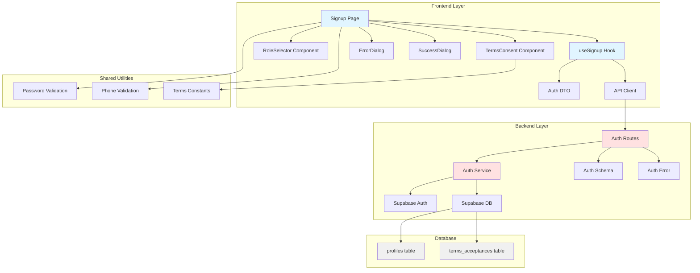
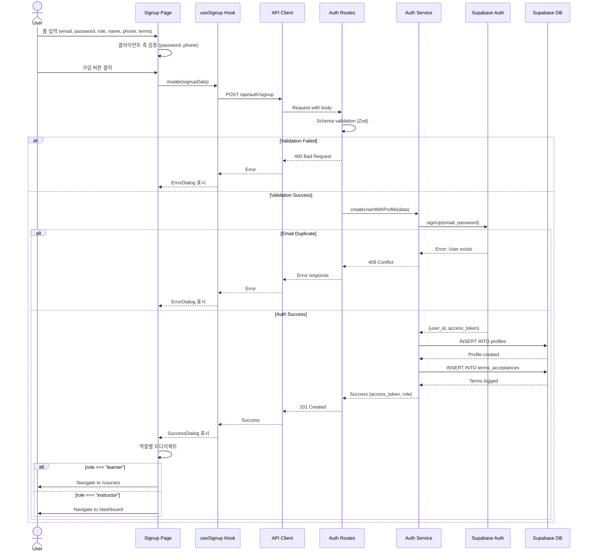

# UC-001: 역할 선택 & 온보딩 - Implementation Plan

## 개요

### 핵심 모듈 목록

#### Backend Layer
| 모듈 | 위치 | 설명 |
|------|------|------|
| Auth Routes | `src/features/auth/backend/route.ts` | POST /auth/signup 엔드포인트 정의 |
| Auth Service | `src/features/auth/backend/service.ts` | 회원가입 비즈니스 로직 (Supabase Auth + DB 트랜잭션) |
| Auth Schema | `src/features/auth/backend/schema.ts` | 회원가입 요청/응답 Zod 스키마 정의 |
| Auth Error | `src/features/auth/backend/error.ts` | 회원가입 관련 에러 코드 정의 |

#### Frontend Layer
| 모듈 | 위치 | 설명 |
|------|------|------|
| Signup Page | `src/app/signup/page.tsx` | 회원가입 페이지 (역할 선택, 프로필 입력, 약관 동의 포함) |
| useSignup Hook | `src/features/auth/hooks/useSignup.ts` | React Query를 사용한 회원가입 mutation 훅 |
| Auth DTO | `src/features/auth/lib/dto.ts` | 클라이언트 측 스키마 재노출 |
| RoleSelector Component | `src/features/auth/components/role-selector.tsx` | 역할 선택 UI 컴포넌트 (Learner/Instructor) |
| TermsConsent Component | `src/features/auth/components/terms-consent.tsx` | 약관 동의 체크박스 컴포넌트 |
| ErrorDialog Component | `src/components/ui/error-dialog.tsx` | 에러 메시지 표시 다이얼로그 |
| SuccessDialog Component | `src/components/ui/success-dialog.tsx` | 성공 메시지 표시 다이얼로그 |

#### Shared Utilities
| 모듈 | 위치 | 설명 |
|------|------|------|
| Password Validation | `src/lib/validation/password.ts` | 비밀번호 정책 검증 유틸 (8자 이상, 영문/숫자/특수문자) |
| Phone Validation | `src/lib/validation/phone.ts` | 전화번호 형식 검증 유틸 (010-XXXX-XXXX) |
| Terms Constants | `src/constants/terms.ts` | 약관 버전 및 타입 상수 |

#### Database
| 모듈 | 위치 | 설명 |
|------|------|------|
| LMS Schema Migration | `supabase/migrations/0002_create_lms_schema.sql` | 이미 존재 (profiles, terms_acceptances 테이블 포함) |

---

## Diagram

### Module Relationship (Mermaid)



### Sequence Flow (Mermaid)



---

## Implementation Plan

### Phase 1: Shared Utilities & Constants

#### 1.1 Password Validation Utility

**File**: `src/lib/validation/password.ts`

**Purpose**: 비밀번호 정책 검증 로직을 중앙화하여 프론트엔드/백엔드 모두에서 재사용

**Implementation**:
```typescript
export const PASSWORD_MIN_LENGTH = 8;
export const PASSWORD_REGEX = /^(?=.*[A-Za-z])(?=.*\d)(?=.*[@$!%*#?&])[A-Za-z\d@$!%*#?&]{8,}$/;

export const validatePassword = (password: string): { valid: boolean; message?: string } => {
  if (password.length < PASSWORD_MIN_LENGTH) {
    return { valid: false, message: '비밀번호는 최소 8자 이상이어야 합니다.' };
  }
  
  if (!PASSWORD_REGEX.test(password)) {
    return { 
      valid: false, 
      message: '비밀번호는 영문, 숫자, 특수문자를 포함해야 합니다.' 
    };
  }
  
  return { valid: true };
};
```

**Unit Test**:
```typescript
describe('validatePassword', () => {
  it('should reject passwords shorter than 8 characters', () => {
    expect(validatePassword('Ab1@')).toMatchObject({ valid: false });
  });
  
  it('should reject passwords without special characters', () => {
    expect(validatePassword('Abcd1234')).toMatchObject({ valid: false });
  });
  
  it('should reject passwords without numbers', () => {
    expect(validatePassword('Abcd@efg')).toMatchObject({ valid: false });
  });
  
  it('should reject passwords without letters', () => {
    expect(validatePassword('12345678@')).toMatchObject({ valid: false });
  });
  
  it('should accept valid passwords', () => {
    expect(validatePassword('Abcd123@')).toMatchObject({ valid: true });
  });
});
```

---

#### 1.2 Phone Validation Utility

**File**: `src/lib/validation/phone.ts`

**Purpose**: 한국 휴대폰 번호 형식 검증 (010-XXXX-XXXX)

**Implementation**:
```typescript
export const PHONE_REGEX = /^010-\d{4}-\d{4}$/;

export const validatePhone = (phone: string): { valid: boolean; message?: string } => {
  if (!PHONE_REGEX.test(phone)) {
    return { 
      valid: false, 
      message: '휴대폰 번호는 010-XXXX-XXXX 형식이어야 합니다.' 
    };
  }
  
  return { valid: true };
};

export const formatPhoneInput = (value: string): string => {
  const digits = value.replace(/\D/g, '');
  
  if (digits.length <= 3) return digits;
  if (digits.length <= 7) return `${digits.slice(0, 3)}-${digits.slice(3)}`;
  return `${digits.slice(0, 3)}-${digits.slice(3, 7)}-${digits.slice(7, 11)}`;
};
```

**Unit Test**:
```typescript
describe('validatePhone', () => {
  it('should reject invalid phone formats', () => {
    expect(validatePhone('01012345678')).toMatchObject({ valid: false });
    expect(validatePhone('010-1234-567')).toMatchObject({ valid: false });
    expect(validatePhone('011-1234-5678')).toMatchObject({ valid: false });
  });
  
  it('should accept valid phone format', () => {
    expect(validatePhone('010-1234-5678')).toMatchObject({ valid: true });
  });
});

describe('formatPhoneInput', () => {
  it('should format phone input with dashes', () => {
    expect(formatPhoneInput('01012345678')).toBe('010-1234-5678');
    expect(formatPhoneInput('0101234')).toBe('010-1234');
    expect(formatPhoneInput('010')).toBe('010');
  });
});
```

---

#### 1.3 Terms Constants

**File**: `src/constants/terms.ts`

**Purpose**: 약관 타입 및 버전 정보 중앙 관리

**Implementation**:
```typescript
export const TERMS_VERSION = '1.0.0';

export const TERMS_TYPES = {
  SERVICE: 'service_terms',
  PRIVACY: 'privacy_policy',
} as const;

export type TermsType = typeof TERMS_TYPES[keyof typeof TERMS_TYPES];

export const TERMS_LABELS: Record<TermsType, string> = {
  [TERMS_TYPES.SERVICE]: '이용약관',
  [TERMS_TYPES.PRIVACY]: '개인정보 처리방침',
};
```

---

### Phase 2: Backend Layer

#### 2.1 Auth Schema

**File**: `src/features/auth/backend/schema.ts`

**Purpose**: 회원가입 요청/응답 스키마 정의

**Implementation**:
```typescript
import { z } from 'zod';
import { PASSWORD_MIN_LENGTH, PASSWORD_REGEX } from '@/lib/validation/password';
import { PHONE_REGEX } from '@/lib/validation/phone';

export const SignupRequestSchema = z.object({
  email: z.string().email({ message: '올바른 이메일 형식이 아닙니다.' }),
  password: z
    .string()
    .min(PASSWORD_MIN_LENGTH, { message: `비밀번호는 최소 ${PASSWORD_MIN_LENGTH}자 이상이어야 합니다.` })
    .regex(PASSWORD_REGEX, { message: '비밀번호는 영문, 숫자, 특수문자를 포함해야 합니다.' }),
  role: z.enum(['learner', 'instructor'], { 
    errorMap: () => ({ message: '역할은 learner 또는 instructor만 선택 가능합니다.' }) 
  }),
  fullName: z
    .string()
    .min(2, { message: '이름은 최소 2자 이상이어야 합니다.' })
    .max(50, { message: '이름은 최대 50자까지 입력 가능합니다.' }),
  phoneNumber: z
    .string()
    .regex(PHONE_REGEX, { message: '휴대폰 번호는 010-XXXX-XXXX 형식이어야 합니다.' }),
  termsConsent: z.object({
    service: z.boolean().refine((val) => val === true, { 
      message: '이용약관에 동의해야 합니다.' 
    }),
    privacy: z.boolean().refine((val) => val === true, { 
      message: '개인정보 처리방침에 동의해야 합니다.' 
    }),
  }),
});

export const SignupResponseSchema = z.object({
  userId: z.string().uuid(),
  email: z.string().email(),
  role: z.enum(['learner', 'instructor']),
  accessToken: z.string(),
  redirectUrl: z.string().url(),
});

export type SignupRequest = z.infer<typeof SignupRequestSchema>;
export type SignupResponse = z.infer<typeof SignupResponseSchema>;
```

**Unit Test**:
```typescript
describe('SignupRequestSchema', () => {
  const validData = {
    email: 'test@example.com',
    password: 'Test123@',
    role: 'learner',
    fullName: '홍길동',
    phoneNumber: '010-1234-5678',
    termsConsent: { service: true, privacy: true },
  };
  
  it('should accept valid signup data', () => {
    expect(SignupRequestSchema.safeParse(validData).success).toBe(true);
  });
  
  it('should reject invalid email', () => {
    const result = SignupRequestSchema.safeParse({ ...validData, email: 'invalid' });
    expect(result.success).toBe(false);
  });
  
  it('should reject weak password', () => {
    const result = SignupRequestSchema.safeParse({ ...validData, password: '1234' });
    expect(result.success).toBe(false);
  });
  
  it('should reject invalid role', () => {
    const result = SignupRequestSchema.safeParse({ ...validData, role: 'admin' });
    expect(result.success).toBe(false);
  });
  
  it('should reject invalid phone format', () => {
    const result = SignupRequestSchema.safeParse({ ...validData, phoneNumber: '01012345678' });
    expect(result.success).toBe(false);
  });
  
  it('should reject if terms not consented', () => {
    const result = SignupRequestSchema.safeParse({ 
      ...validData, 
      termsConsent: { service: true, privacy: false } 
    });
    expect(result.success).toBe(false);
  });
});
```

---

#### 2.2 Auth Error Codes

**File**: `src/features/auth/backend/error.ts`

**Purpose**: 인증 관련 에러 코드 정의

**Implementation**:
```typescript
export const authErrorCodes = {
  emailAlreadyExists: 'AUTH_EMAIL_ALREADY_EXISTS',
  weakPassword: 'AUTH_WEAK_PASSWORD',
  invalidEmail: 'AUTH_INVALID_EMAIL',
  invalidPhone: 'AUTH_INVALID_PHONE',
  termsNotConsented: 'AUTH_TERMS_NOT_CONSENTED',
  authServiceError: 'AUTH_SERVICE_ERROR',
  profileCreationError: 'AUTH_PROFILE_CREATION_ERROR',
  termsLogError: 'AUTH_TERMS_LOG_ERROR',
  validationError: 'AUTH_VALIDATION_ERROR',
} as const;

type AuthErrorValue = (typeof authErrorCodes)[keyof typeof authErrorCodes];

export type AuthServiceError = AuthErrorValue;
```

---

#### 2.3 Auth Service

**File**: `src/features/auth/backend/service.ts`

**Purpose**: 회원가입 비즈니스 로직 (Supabase Auth + DB 트랜잭션 처리)

**Implementation**:
```typescript
import type { SupabaseClient } from '@supabase/supabase-js';
import {
  failure,
  success,
  type HandlerResult,
} from '@/backend/http/response';
import { TERMS_VERSION, TERMS_TYPES } from '@/constants/terms';
import {
  authErrorCodes,
  type AuthServiceError,
} from '@/features/auth/backend/error';
import type { SignupRequest, SignupResponse } from './schema';

export const createUserWithProfile = async (
  client: SupabaseClient,
  data: SignupRequest,
): Promise<HandlerResult<SignupResponse, AuthServiceError, unknown>> => {
  // Step 1: Supabase Auth 계정 생성
  const { data: authData, error: authError } = await client.auth.signUp({
    email: data.email,
    password: data.password,
  });

  if (authError) {
    if (authError.message.includes('already registered')) {
      return failure(409, authErrorCodes.emailAlreadyExists, '이미 가입된 이메일입니다.');
    }
    return failure(500, authErrorCodes.authServiceError, authError.message);
  }

  if (!authData.user) {
    return failure(500, authErrorCodes.authServiceError, '사용자 생성에 실패했습니다.');
  }

  const userId = authData.user.id;

  // Step 2: profiles 테이블에 사용자 프로필 생성
  const { error: profileError } = await client
    .from('profiles')
    .insert({
      id: userId,
      role: data.role,
      full_name: data.fullName,
      phone_number: data.phoneNumber,
    });

  if (profileError) {
    // Rollback: Auth 계정 삭제 시도
    await client.auth.admin.deleteUser(userId);
    return failure(500, authErrorCodes.profileCreationError, '프로필 생성에 실패했습니다.');
  }

  // Step 3: terms_acceptances 테이블에 약관 동의 이력 저장
  const termsToInsert = [
    {
      user_id: userId,
      version: TERMS_VERSION,
      accepted_at: new Date().toISOString(),
    },
  ];

  const { error: termsError } = await client
    .from('terms_acceptances')
    .insert(termsToInsert);

  if (termsError) {
    // Rollback: 프로필 삭제 시도 (Auth는 CASCADE로 자동 삭제됨)
    await client.from('profiles').delete().eq('id', userId);
    await client.auth.admin.deleteUser(userId);
    return failure(500, authErrorCodes.termsLogError, '약관 동의 이력 저장에 실패했습니다.');
  }

  // Step 4: 역할별 리다이렉트 URL 결정
  const redirectUrl = data.role === 'learner' ? '/courses' : '/dashboard';

  return success({
    userId,
    email: data.email,
    role: data.role,
    accessToken: authData.session?.access_token ?? '',
    redirectUrl,
  }, 201);
};
```

**Unit Test**:
```typescript
describe('createUserWithProfile', () => {
  let mockSupabase: jest.Mocked<SupabaseClient>;
  
  beforeEach(() => {
    mockSupabase = createMockSupabaseClient();
  });
  
  it('should create user with profile and terms acceptance', async () => {
    mockSupabase.auth.signUp.mockResolvedValue({
      data: { user: { id: 'user-123', email: 'test@example.com' }, session: { access_token: 'token' } },
      error: null,
    });
    mockSupabase.from('profiles').insert.mockResolvedValue({ error: null });
    mockSupabase.from('terms_acceptances').insert.mockResolvedValue({ error: null });
    
    const result = await createUserWithProfile(mockSupabase, {
      email: 'test@example.com',
      password: 'Test123@',
      role: 'learner',
      fullName: '홍길동',
      phoneNumber: '010-1234-5678',
      termsConsent: { service: true, privacy: true },
    });
    
    expect(result.ok).toBe(true);
    if (result.ok) {
      expect(result.data.userId).toBe('user-123');
      expect(result.data.role).toBe('learner');
      expect(result.data.redirectUrl).toBe('/courses');
    }
  });
  
  it('should return 409 when email already exists', async () => {
    mockSupabase.auth.signUp.mockResolvedValue({
      data: null,
      error: { message: 'User already registered' },
    });
    
    const result = await createUserWithProfile(mockSupabase, validSignupData);
    
    expect(result.ok).toBe(false);
    if (!result.ok) {
      expect(result.status).toBe(409);
      expect(result.error.code).toBe(authErrorCodes.emailAlreadyExists);
    }
  });
  
  it('should rollback when profile creation fails', async () => {
    mockSupabase.auth.signUp.mockResolvedValue({
      data: { user: { id: 'user-123' } },
      error: null,
    });
    mockSupabase.from('profiles').insert.mockResolvedValue({ 
      error: { message: 'Profile error' } 
    });
    
    const result = await createUserWithProfile(mockSupabase, validSignupData);
    
    expect(result.ok).toBe(false);
    expect(mockSupabase.auth.admin.deleteUser).toHaveBeenCalledWith('user-123');
  });
});
```

---

#### 2.4 Auth Routes

**File**: `src/features/auth/backend/route.ts`

**Purpose**: POST /auth/signup 엔드포인트 라우터 정의

**Implementation**:
```typescript
import type { Hono } from 'hono';
import {
  failure,
  respond,
  type ErrorResult,
} from '@/backend/http/response';
import {
  getLogger,
  getSupabase,
  type AppEnv,
} from '@/backend/hono/context';
import { SignupRequestSchema } from './schema';
import { createUserWithProfile } from './service';
import {
  authErrorCodes,
  type AuthServiceError,
} from './error';

export const registerAuthRoutes = (app: Hono<AppEnv>) => {
  app.post('/auth/signup', async (c) => {
    const body = await c.req.json();
    const parsedBody = SignupRequestSchema.safeParse(body);

    if (!parsedBody.success) {
      return respond(
        c,
        failure(
          400,
          authErrorCodes.validationError,
          '입력값이 유효하지 않습니다.',
          parsedBody.error.format(),
        ),
      );
    }

    const supabase = getSupabase(c);
    const logger = getLogger(c);

    const result = await createUserWithProfile(supabase, parsedBody.data);

    if (!result.ok) {
      const errorResult = result as ErrorResult<AuthServiceError, unknown>;
      logger.error('Signup failed', {
        code: errorResult.error.code,
        message: errorResult.error.message,
      });
      return respond(c, result);
    }

    logger.info('User signup successful', { userId: result.data.userId });
    return respond(c, result);
  });
};
```

**Unit Test**:
```typescript
describe('POST /auth/signup', () => {
  it('should return 400 when request body is invalid', async () => {
    const res = await app.request('/auth/signup', {
      method: 'POST',
      body: JSON.stringify({ email: 'invalid' }),
      headers: { 'Content-Type': 'application/json' },
    });
    
    expect(res.status).toBe(400);
    const body = await res.json();
    expect(body.error.code).toBe(authErrorCodes.validationError);
  });
  
  it('should return 201 when signup is successful', async () => {
    const res = await app.request('/auth/signup', {
      method: 'POST',
      body: JSON.stringify(validSignupData),
      headers: { 'Content-Type': 'application/json' },
    });
    
    expect(res.status).toBe(201);
    const body = await res.json();
    expect(body.userId).toBeDefined();
    expect(body.accessToken).toBeDefined();
  });
});
```

**Hono App Registration**:

`src/backend/hono/app.ts`에 다음 라인 추가:
```typescript
import { registerAuthRoutes } from '@/features/auth/backend/route';

// 기존 코드...
registerExampleRoutes(app);
registerAuthRoutes(app); // 추가
```

---

### Phase 3: Frontend Layer

#### 3.1 Auth DTO

**File**: `src/features/auth/lib/dto.ts`

**Purpose**: 클라이언트 측에서 사용할 스키마 재노출

**Implementation**:
```typescript
export {
  SignupRequestSchema,
  SignupResponseSchema,
  type SignupRequest,
  type SignupResponse,
} from '../backend/schema';
```

---

#### 3.2 useSignup Hook

**File**: `src/features/auth/hooks/useSignup.ts`

**Purpose**: 회원가입 mutation을 위한 React Query 훅

**Implementation**:
```typescript
import { useMutation } from '@tanstack/react-query';
import { apiClient, extractApiErrorMessage } from '@/lib/remote/api-client';
import type { SignupRequest, SignupResponse } from '../lib/dto';

const signup = async (data: SignupRequest): Promise<SignupResponse> => {
  const response = await apiClient.post<SignupResponse>('/api/auth/signup', data);
  return response.data;
};

export const useSignup = () => {
  return useMutation({
    mutationFn: signup,
    onError: (error) => {
      console.error('Signup failed:', extractApiErrorMessage(error));
    },
  });
};
```

---

#### 3.3 RoleSelector Component

**File**: `src/features/auth/components/role-selector.tsx`

**Purpose**: 역할 선택 UI 컴포넌트 (Learner/Instructor)

**Implementation**:
```typescript
"use client";

import { useState } from 'react';
import { cn } from '@/lib/utils';
import { BookOpen, GraduationCap } from 'lucide-react';

type Role = 'learner' | 'instructor';

type RoleSelectorProps = {
  value: Role | null;
  onChange: (role: Role) => void;
  disabled?: boolean;
};

export const RoleSelector = ({ value, onChange, disabled }: RoleSelectorProps) => {
  const roles = [
    {
      value: 'learner' as const,
      label: '학습자',
      description: '코스를 수강하고 과제를 제출합니다',
      icon: BookOpen,
    },
    {
      value: 'instructor' as const,
      label: '강사',
      description: '코스를 만들고 학생을 관리합니다',
      icon: GraduationCap,
    },
  ];

  return (
    <div className="grid gap-4 md:grid-cols-2">
      {roles.map((role) => {
        const Icon = role.icon;
        const isSelected = value === role.value;
        
        return (
          <button
            key={role.value}
            type="button"
            disabled={disabled}
            onClick={() => onChange(role.value)}
            className={cn(
              'flex flex-col items-start gap-2 rounded-lg border-2 p-4 text-left transition',
              'hover:border-slate-400 focus:outline-none focus:ring-2 focus:ring-slate-500',
              isSelected ? 'border-slate-900 bg-slate-50' : 'border-slate-200',
              disabled && 'cursor-not-allowed opacity-50'
            )}
          >
            <Icon className={cn('h-8 w-8', isSelected ? 'text-slate-900' : 'text-slate-500')} />
            <div>
              <h3 className="font-semibold text-slate-900">{role.label}</h3>
              <p className="text-sm text-slate-600">{role.description}</p>
            </div>
          </button>
        );
      })}
    </div>
  );
};
```

**QA Sheet**:

| Test Case | Steps | Expected Result |
|-----------|-------|-----------------|
| 초기 상태 | 컴포넌트 렌더링 | 두 개의 역할 카드가 표시됨 |
| 학습자 선택 | "학습자" 카드 클릭 | 카드 스타일이 선택됨으로 변경, onChange 호출됨 |
| 강사 선택 | "강사" 카드 클릭 | 카드 스타일이 선택됨으로 변경, onChange 호출됨 |
| 역할 전환 | 학습자 → 강사 선택 | 강사만 선택된 상태로 변경 |
| Disabled 상태 | disabled={true} 설정 | 클릭 불가, 투명도 감소 |
| 키보드 접근성 | Tab으로 포커스 이동 | 포커스 링이 표시됨 |

---

#### 3.4 TermsConsent Component

**File**: `src/features/auth/components/terms-consent.tsx`

**Purpose**: 약관 동의 체크박스 컴포넌트

**Implementation**:
```typescript
"use client";

import { Checkbox } from '@/components/ui/checkbox';
import { TERMS_LABELS, TERMS_TYPES } from '@/constants/terms';

type TermsConsentValue = {
  service: boolean;
  privacy: boolean;
};

type TermsConsentProps = {
  value: TermsConsentValue;
  onChange: (value: TermsConsentValue) => void;
  disabled?: boolean;
};

export const TermsConsent = ({ value, onChange, disabled }: TermsConsentProps) => {
  const handleChange = (key: keyof TermsConsentValue, checked: boolean) => {
    onChange({ ...value, [key]: checked });
  };

  const handleAllChange = (checked: boolean) => {
    onChange({ service: checked, privacy: checked });
  };

  const allChecked = value.service && value.privacy;

  return (
    <div className="flex flex-col gap-3 rounded-lg border border-slate-200 p-4">
      <div className="flex items-center gap-2">
        <Checkbox
          id="terms-all"
          checked={allChecked}
          onCheckedChange={handleAllChange}
          disabled={disabled}
        />
        <label
          htmlFor="terms-all"
          className="text-sm font-semibold text-slate-900 cursor-pointer"
        >
          전체 동의
        </label>
      </div>
      
      <div className="ml-6 flex flex-col gap-2 border-t border-slate-100 pt-3">
        <div className="flex items-center gap-2">
          <Checkbox
            id="terms-service"
            checked={value.service}
            onCheckedChange={(checked) => handleChange('service', checked as boolean)}
            disabled={disabled}
          />
          <label
            htmlFor="terms-service"
            className="text-sm text-slate-700 cursor-pointer"
          >
            {TERMS_LABELS[TERMS_TYPES.SERVICE]} (필수)
          </label>
        </div>
        
        <div className="flex items-center gap-2">
          <Checkbox
            id="terms-privacy"
            checked={value.privacy}
            onCheckedChange={(checked) => handleChange('privacy', checked as boolean)}
            disabled={disabled}
          />
          <label
            htmlFor="terms-privacy"
            className="text-sm text-slate-700 cursor-pointer"
          >
            {TERMS_LABELS[TERMS_TYPES.PRIVACY]} (필수)
          </label>
        </div>
      </div>
    </div>
  );
};
```

**QA Sheet**:

| Test Case | Steps | Expected Result |
|-----------|-------|-----------------|
| 초기 상태 | 컴포넌트 렌더링 | 전체 동의, 이용약관, 개인정보 체크박스 표시 |
| 개별 체크 | 이용약관 체크 | 이용약관만 선택됨 |
| 전체 동의 체크 | "전체 동의" 체크 | 모든 체크박스 선택됨 |
| 전체 동의 해제 | "전체 동의" 체크 해제 | 모든 체크박스 해제됨 |
| 부분 선택 시 전체 동의 | 이용약관만 선택 | "전체 동의" 체크 해제 상태 |
| Disabled 상태 | disabled={true} 설정 | 모든 체크박스 비활성화 |

---

#### 3.5 ErrorDialog Component

**File**: `src/components/ui/error-dialog.tsx`

**Purpose**: 에러 메시지를 다이얼로그로 표시

**Implementation**:
```typescript
"use client";

import {
  Dialog,
  DialogContent,
  DialogDescription,
  DialogFooter,
  DialogHeader,
  DialogTitle,
} from '@/components/ui/dialog';
import { Button } from '@/components/ui/button';
import { AlertCircle } from 'lucide-react';

type ErrorDialogProps = {
  open: boolean;
  onClose: () => void;
  title?: string;
  message: string;
};

export const ErrorDialog = ({
  open,
  onClose,
  title = '오류',
  message,
}: ErrorDialogProps) => {
  return (
    <Dialog open={open} onOpenChange={(open) => !open && onClose()}>
      <DialogContent>
        <DialogHeader>
          <div className="flex items-center gap-2">
            <AlertCircle className="h-5 w-5 text-rose-500" />
            <DialogTitle>{title}</DialogTitle>
          </div>
          <DialogDescription>{message}</DialogDescription>
        </DialogHeader>
        <DialogFooter>
          <Button onClick={onClose} variant="default">
            확인
          </Button>
        </DialogFooter>
      </DialogContent>
    </Dialog>
  );
};
```

**QA Sheet**:

| Test Case | Steps | Expected Result |
|-----------|-------|-----------------|
| 열기 | open={true} 설정 | 다이얼로그 표시, 에러 메시지 표시 |
| 닫기 버튼 | "확인" 버튼 클릭 | onClose 호출됨, 다이얼로그 닫힘 |
| ESC 키 | ESC 키 누름 | onClose 호출됨, 다이얼로그 닫힘 |
| 배경 클릭 | 다이얼로그 외부 클릭 | onClose 호출됨, 다이얼로그 닫힘 |
| 아이콘 표시 | 다이얼로그 열기 | AlertCircle 아이콘이 빨간색으로 표시 |

---

#### 3.6 SuccessDialog Component

**File**: `src/components/ui/success-dialog.tsx`

**Purpose**: 성공 메시지를 다이얼로그로 표시

**Implementation**:
```typescript
"use client";

import {
  Dialog,
  DialogContent,
  DialogDescription,
  DialogFooter,
  DialogHeader,
  DialogTitle,
} from '@/components/ui/dialog';
import { Button } from '@/components/ui/button';
import { CheckCircle } from 'lucide-react';

type SuccessDialogProps = {
  open: boolean;
  onClose: () => void;
  title?: string;
  message: string;
};

export const SuccessDialog = ({
  open,
  onClose,
  title = '성공',
  message,
}: SuccessDialogProps) => {
  return (
    <Dialog open={open} onOpenChange={(open) => !open && onClose()}>
      <DialogContent>
        <DialogHeader>
          <div className="flex items-center gap-2">
            <CheckCircle className="h-5 w-5 text-emerald-500" />
            <DialogTitle>{title}</DialogTitle>
          </div>
          <DialogDescription>{message}</DialogDescription>
        </DialogHeader>
        <DialogFooter>
          <Button onClick={onClose} variant="default">
            확인
          </Button>
        </DialogFooter>
      </DialogContent>
    </Dialog>
  );
};
```

**QA Sheet**:

| Test Case | Steps | Expected Result |
|-----------|-------|-----------------|
| 열기 | open={true} 설정 | 다이얼로그 표시, 성공 메시지 표시 |
| 닫기 버튼 | "확인" 버튼 클릭 | onClose 호출됨, 다이얼로그 닫힘 |
| ESC 키 | ESC 키 누름 | onClose 호출됨, 다이얼로그 닫힘 |
| 배경 클릭 | 다이얼로그 외부 클릭 | onClose 호출됨, 다이얼로그 닫힘 |
| 아이콘 표시 | 다이얼로그 열기 | CheckCircle 아이콘이 초록색으로 표시 |

---

#### 3.7 Signup Page

**File**: `src/app/signup/page.tsx`

**Purpose**: 회원가입 페이지 (역할 선택, 프로필 입력, 약관 동의 포함)

**Implementation**:
```typescript
"use client";

import { useCallback, useEffect, useState } from "react";
import Image from "next/image";
import Link from "next/link";
import { useRouter, useSearchParams } from "next/navigation";
import { useCurrentUser } from "@/features/auth/hooks/useCurrentUser";
import { useSignup } from "@/features/auth/hooks/useSignup";
import { RoleSelector } from "@/features/auth/components/role-selector";
import { TermsConsent } from "@/features/auth/components/terms-consent";
import { ErrorDialog } from "@/components/ui/error-dialog";
import { SuccessDialog } from "@/components/ui/success-dialog";
import { validatePassword } from "@/lib/validation/password";
import { formatPhoneInput, validatePhone } from "@/lib/validation/phone";
import { extractApiErrorMessage } from "@/lib/remote/api-client";
import type { SignupRequest } from "@/features/auth/lib/dto";

type SignupPageProps = {
  params: Promise<Record<string, never>>;
};

export default function SignupPage({ params }: SignupPageProps) {
  void params;
  const router = useRouter();
  const searchParams = useSearchParams();
  const { isAuthenticated, refresh } = useCurrentUser();
  const signupMutation = useSignup();

  const [formState, setFormState] = useState({
    email: "",
    password: "",
    confirmPassword: "",
    role: null as "learner" | "instructor" | null,
    fullName: "",
    phoneNumber: "",
    termsConsent: { service: false, privacy: false },
  });

  const [validationErrors, setValidationErrors] = useState<Record<string, string>>({});
  const [errorDialogOpen, setErrorDialogOpen] = useState(false);
  const [errorMessage, setErrorMessage] = useState("");
  const [successDialogOpen, setSuccessDialogOpen] = useState(false);

  useEffect(() => {
    if (isAuthenticated) {
      const redirectedFrom = searchParams.get("redirectedFrom") ?? "/";
      router.replace(redirectedFrom);
    }
  }, [isAuthenticated, router, searchParams]);

  const validateForm = useCallback((): boolean => {
    const errors: Record<string, string> = {};

    if (!formState.email.trim()) {
      errors.email = "이메일을 입력해주세요.";
    }

    const passwordValidation = validatePassword(formState.password);
    if (!passwordValidation.valid) {
      errors.password = passwordValidation.message!;
    }

    if (formState.password !== formState.confirmPassword) {
      errors.confirmPassword = "비밀번호가 일치하지 않습니다.";
    }

    if (!formState.role) {
      errors.role = "역할을 선택해주세요.";
    }

    if (!formState.fullName.trim()) {
      errors.fullName = "이름을 입력해주세요.";
    }

    const phoneValidation = validatePhone(formState.phoneNumber);
    if (!phoneValidation.valid) {
      errors.phoneNumber = phoneValidation.message!;
    }

    if (!formState.termsConsent.service || !formState.termsConsent.privacy) {
      errors.terms = "필수 약관에 동의해주세요.";
    }

    setValidationErrors(errors);
    return Object.keys(errors).length === 0;
  }, [formState]);

  const handleSubmit = useCallback(
    async (event: React.FormEvent<HTMLFormElement>) => {
      event.preventDefault();

      if (!validateForm()) {
        return;
      }

      const signupData: SignupRequest = {
        email: formState.email,
        password: formState.password,
        role: formState.role!,
        fullName: formState.fullName,
        phoneNumber: formState.phoneNumber,
        termsConsent: formState.termsConsent,
      };

      signupMutation.mutate(signupData, {
        onSuccess: async (data) => {
          setSuccessDialogOpen(true);
          await refresh();
          
          setTimeout(() => {
            router.push(data.redirectUrl);
          }, 1500);
        },
        onError: (error) => {
          setErrorMessage(extractApiErrorMessage(error, "회원가입에 실패했습니다."));
          setErrorDialogOpen(true);
        },
      });
    },
    [formState, validateForm, signupMutation, refresh, router]
  );

  const handlePhoneChange = (e: React.ChangeEvent<HTMLInputElement>) => {
    const formatted = formatPhoneInput(e.target.value);
    setFormState((prev) => ({ ...prev, phoneNumber: formatted }));
  };

  if (isAuthenticated) {
    return null;
  }

  return (
    <div className="mx-auto flex min-h-screen w-full max-w-6xl flex-col items-center justify-center gap-10 px-6 py-16">
      <header className="flex flex-col items-center gap-3 text-center">
        <h1 className="text-3xl font-semibold">회원가입</h1>
        <p className="text-slate-500">
          학습자 또는 강사로 가입하여 LMS 플랫폼을 시작하세요.
        </p>
      </header>

      <div className="grid w-full gap-8 md:grid-cols-2">
        <form
          onSubmit={handleSubmit}
          className="flex flex-col gap-5 rounded-xl border border-slate-200 p-6 shadow-sm"
        >
          {/* 역할 선택 */}
          <div>
            <label className="mb-2 block text-sm font-medium text-slate-700">
              역할 선택 *
            </label>
            <RoleSelector
              value={formState.role}
              onChange={(role) => setFormState((prev) => ({ ...prev, role }))}
              disabled={signupMutation.isPending}
            />
            {validationErrors.role && (
              <p className="mt-1 text-sm text-rose-500">{validationErrors.role}</p>
            )}
          </div>

          {/* 이메일 */}
          <label className="flex flex-col gap-2 text-sm text-slate-700">
            이메일 *
            <input
              type="email"
              name="email"
              autoComplete="email"
              required
              value={formState.email}
              onChange={(e) => setFormState((prev) => ({ ...prev, email: e.target.value }))}
              className="rounded-md border border-slate-300 px-3 py-2 focus:border-slate-500 focus:outline-none"
            />
            {validationErrors.email && (
              <span className="text-rose-500">{validationErrors.email}</span>
            )}
          </label>

          {/* 비밀번호 */}
          <label className="flex flex-col gap-2 text-sm text-slate-700">
            비밀번호 *
            <input
              type="password"
              name="password"
              autoComplete="new-password"
              required
              value={formState.password}
              onChange={(e) => setFormState((prev) => ({ ...prev, password: e.target.value }))}
              className="rounded-md border border-slate-300 px-3 py-2 focus:border-slate-500 focus:outline-none"
            />
            {validationErrors.password && (
              <span className="text-rose-500">{validationErrors.password}</span>
            )}
          </label>

          {/* 비밀번호 확인 */}
          <label className="flex flex-col gap-2 text-sm text-slate-700">
            비밀번호 확인 *
            <input
              type="password"
              name="confirmPassword"
              autoComplete="new-password"
              required
              value={formState.confirmPassword}
              onChange={(e) => setFormState((prev) => ({ ...prev, confirmPassword: e.target.value }))}
              className="rounded-md border border-slate-300 px-3 py-2 focus:border-slate-500 focus:outline-none"
            />
            {validationErrors.confirmPassword && (
              <span className="text-rose-500">{validationErrors.confirmPassword}</span>
            )}
          </label>

          {/* 이름 */}
          <label className="flex flex-col gap-2 text-sm text-slate-700">
            이름 *
            <input
              type="text"
              name="fullName"
              autoComplete="name"
              required
              value={formState.fullName}
              onChange={(e) => setFormState((prev) => ({ ...prev, fullName: e.target.value }))}
              className="rounded-md border border-slate-300 px-3 py-2 focus:border-slate-500 focus:outline-none"
            />
            {validationErrors.fullName && (
              <span className="text-rose-500">{validationErrors.fullName}</span>
            )}
          </label>

          {/* 휴대폰 번호 */}
          <label className="flex flex-col gap-2 text-sm text-slate-700">
            휴대폰 번호 *
            <input
              type="tel"
              name="phoneNumber"
              autoComplete="tel"
              required
              placeholder="010-1234-5678"
              value={formState.phoneNumber}
              onChange={handlePhoneChange}
              className="rounded-md border border-slate-300 px-3 py-2 focus:border-slate-500 focus:outline-none"
            />
            {validationErrors.phoneNumber && (
              <span className="text-rose-500">{validationErrors.phoneNumber}</span>
            )}
          </label>

          {/* 약관 동의 */}
          <div>
            <TermsConsent
              value={formState.termsConsent}
              onChange={(termsConsent) => setFormState((prev) => ({ ...prev, termsConsent }))}
              disabled={signupMutation.isPending}
            />
            {validationErrors.terms && (
              <p className="mt-1 text-sm text-rose-500">{validationErrors.terms}</p>
            )}
          </div>

          {/* 제출 버튼 */}
          <button
            type="submit"
            disabled={signupMutation.isPending}
            className="rounded-md bg-slate-900 px-4 py-2 text-sm font-medium text-white transition hover:bg-slate-700 disabled:cursor-not-allowed disabled:bg-slate-400"
          >
            {signupMutation.isPending ? "가입 중..." : "회원가입"}
          </button>

          <p className="text-xs text-slate-500">
            이미 계정이 있으신가요?{" "}
            <Link
              href="/login"
              className="font-medium text-slate-700 underline hover:text-slate-900"
            >
              로그인으로 이동
            </Link>
          </p>
        </form>

        <figure className="overflow-hidden rounded-xl border border-slate-200">
          <Image
            src="https://picsum.photos/seed/signup-onboarding/800/1000"
            alt="회원가입"
            width={800}
            height={1000}
            className="h-full w-full object-cover"
            priority
          />
        </figure>
      </div>

      {/* Error Dialog */}
      <ErrorDialog
        open={errorDialogOpen}
        onClose={() => setErrorDialogOpen(false)}
        title="회원가입 실패"
        message={errorMessage}
      />

      {/* Success Dialog */}
      <SuccessDialog
        open={successDialogOpen}
        onClose={() => setSuccessDialogOpen(false)}
        title="회원가입 완료"
        message="회원가입이 완료되었습니다. 잠시 후 페이지가 이동됩니다."
      />
    </div>
  );
}
```

**QA Sheet**:

| Test Case | Steps | Expected Result |
|-----------|-------|-----------------|
| 페이지 렌더링 | /signup 접근 | 회원가입 폼과 이미지 표시 |
| 역할 선택 | 학습자 선택 | 역할이 "learner"로 설정됨 |
| 비밀번호 검증 | 약한 비밀번호 입력 | 에러 메시지 표시 |
| 비밀번호 불일치 | 비밀번호와 확인 다르게 입력 | 에러 메시지 표시 |
| 전화번호 자동 포맷 | 01012345678 입력 | 010-1234-5678로 자동 변환 |
| 약관 미동의 | 약관 체크하지 않고 제출 | 에러 메시지 표시 |
| 성공 시나리오 | 모든 필드 올바르게 입력 후 제출 | SuccessDialog 표시 후 리다이렉트 |
| 이메일 중복 | 이미 존재하는 이메일로 가입 시도 | ErrorDialog에 "이미 가입된 이메일" 표시 |
| Learner 리다이렉트 | Learner로 가입 성공 | /courses로 이동 |
| Instructor 리다이렉트 | Instructor로 가입 성공 | /dashboard로 이동 |
| 제출 중 버튼 비활성화 | 제출 버튼 클릭 | 버튼이 "가입 중..." 으로 변경, 비활성화 |

---

### Phase 4: Integration & Testing

#### 4.1 Shadcn-ui Component Installation

회원가입 페이지에서 사용할 shadcn-ui 컴포넌트가 아직 설치되지 않았다면 다음 명령어를 실행해야 합니다:

```bash
$ npx shadcn@latest add dialog
$ npx shadcn@latest add checkbox
```

#### 4.2 Database Migration Application

이미 존재하는 마이그레이션 파일 `supabase/migrations/0002_create_lms_schema.sql`을 Supabase 대시보드에서 실행해야 합니다.

**확인 사항**:
- `profiles` 테이블 존재 여부
- `terms_acceptances` 테이블 존재 여부
- `role_type` enum 타입 존재 여부

#### 4.3 Environment Variables

`.env.local` 파일에 다음 환경 변수가 설정되어 있는지 확인:

```env
NEXT_PUBLIC_SUPABASE_URL=your_supabase_url
NEXT_PUBLIC_SUPABASE_ANON_KEY=your_supabase_anon_key
SUPABASE_SERVICE_ROLE_KEY=your_supabase_service_role_key
NEXT_PUBLIC_API_BASE_URL=http://localhost:3000
```

#### 4.4 End-to-End Test Scenarios

**Scenario 1: 학습자 회원가입 성공**
1. `/signup` 페이지 접근
2. 역할: "학습자" 선택
3. 이메일: `learner@test.com` 입력
4. 비밀번호: `Test123@` 입력
5. 비밀번호 확인: `Test123@` 입력
6. 이름: `홍길동` 입력
7. 휴대폰 번호: `010-1234-5678` 입력
8. 약관 전체 동의 체크
9. "회원가입" 버튼 클릭
10. 성공 다이얼로그 표시 확인
11. `/courses` 페이지로 리다이렉트 확인

**Scenario 2: 강사 회원가입 성공**
1. `/signup` 페이지 접근
2. 역할: "강사" 선택
3. 이메일: `instructor@test.com` 입력
4. 비밀번호: `Test123@` 입력
5. 비밀번호 확인: `Test123@` 입력
6. 이름: `김강사` 입력
7. 휴대폰 번호: `010-9876-5432` 입력
8. 약관 전체 동의 체크
9. "회원가입" 버튼 클릭
10. 성공 다이얼로그 표시 확인
11. `/dashboard` 페이지로 리다이렉트 확인

**Scenario 3: 이메일 중복 에러**
1. 이미 가입된 이메일로 회원가입 시도
2. 에러 다이얼로그에 "이미 가입된 이메일입니다" 메시지 표시 확인
3. 폼 상태 유지 확인

**Scenario 4: 비밀번호 정책 위반**
1. 비밀번호: `1234` 입력 (약한 비밀번호)
2. "회원가입" 버튼 클릭
3. 비밀번호 필드 아래 에러 메시지 표시 확인

**Scenario 5: 약관 미동의**
1. 모든 필드 입력
2. 약관 동의 체크하지 않음
3. "회원가입" 버튼 클릭
4. 약관 동의 영역 아래 에러 메시지 표시 확인

---

### Phase 5: 잠재적 개선 사항

#### 5.1 이메일 인증 플로우 추가

현재는 Supabase Auth의 이메일 인증을 사용하지 않지만, 추후 보안 강화를 위해 이메일 인증 플로우를 추가할 수 있습니다.

#### 5.2 비밀번호 강도 인디케이터

비밀번호 입력 시 실시간으로 강도를 표시하는 UI를 추가할 수 있습니다.

#### 5.3 소셜 로그인 연동

Google, GitHub 등의 OAuth 제공자를 통한 소셜 로그인을 추가할 수 있습니다.

#### 5.4 프로필 이미지 업로드

회원가입 시 프로필 이미지를 업로드할 수 있는 기능을 추가할 수 있습니다.

#### 5.5 약관 상세 보기 모달

약관 동의 체크박스 옆에 "보기" 버튼을 추가하여 약관 전문을 모달로 표시할 수 있습니다.

#### 5.6 Analytics 추적

회원가입 퍼널 분석을 위해 각 단계에서 analytics 이벤트를 전송할 수 있습니다.

---

## 결론

본 구현 계획은 UC-001: 역할 선택 & 온보딩 기능을 최소한으로 모듈화하여 설계했습니다. 

**핵심 설계 원칙**:
1. **관심사의 분리**: Backend(비즈니스 로직) / Frontend(UI) / Shared(유틸리티) 계층 분리
2. **재사용성**: 비밀번호/전화번호 검증 로직을 공통 유틸로 분리
3. **타입 안전성**: Zod 스키마를 통한 런타임 검증 및 타입 추론
4. **테스트 가능성**: 각 모듈에 대한 Unit Test 및 QA Sheet 제공
5. **확장 가능성**: 추후 소셜 로그인, 이메일 인증 등 기능 추가 용이

**구현 우선순위**:
1. Phase 1 (Shared Utilities) - 다른 모든 레이어의 기반
2. Phase 2 (Backend Layer) - API 엔드포인트 구현
3. Phase 3 (Frontend Layer) - UI 및 사용자 상호작용
4. Phase 4 (Integration & Testing) - 통합 테스트 및 E2E 시나리오 검증

**예상 작업 시간**:
- Phase 1: 2-3시간
- Phase 2: 4-5시간
- Phase 3: 6-8시간
- Phase 4: 2-3시간
- **총 예상 시간**: 14-19시간

