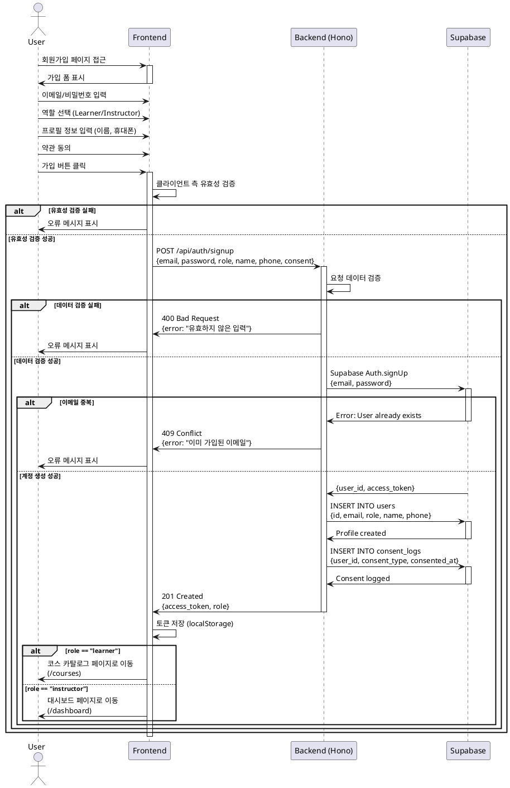

# UC-001: 역할 선택 & 온보딩

## Primary Actor
신규 사용자 (미가입 상태)

## Precondition
- 사용자는 시스템에 가입되지 않은 상태
- 유효한 이메일 주소를 보유

## Trigger
사용자가 회원가입 페이지에 접근하여 가입 프로세스 시작

## Main Scenario

1. 사용자가 이메일과 비밀번호를 입력
2. 사용자가 역할(Learner 또는 Instructor)을 선택
3. 사용자가 공통 프로필 정보를 입력 (이름, 휴대폰번호)
4. 사용자가 이용 약관 및 개인정보 처리방침에 동의
5. 시스템이 입력값의 유효성을 검증
6. 시스템이 Supabase Auth를 통해 계정을 생성
7. 시스템이 선택된 역할을 저장
8. 시스템이 users 테이블에 프로필 레코드를 생성
9. 시스템이 약관 동의 이력을 저장
10. 시스템이 JWT 토큰을 발급하여 사용자 세션을 생성
11. Learner는 코스 카탈로그 페이지로 이동
12. Instructor는 대시보드 페이지로 이동

## Edge Cases

### 이메일 중복
- 이미 등록된 이메일로 가입 시도 시 "이미 가입된 이메일입니다" 오류 메시지 표시
- 재입력 유도

### 비밀번호 강도 미달
- 비밀번호가 최소 8자, 영문/숫자/특수문자 조합 기준 미달 시 오류 메시지 표시
- 재입력 유도

### 전화번호 형식 오류
- 전화번호가 올바른 형식(010-XXXX-XXXX)이 아닌 경우 오류 메시지 표시
- 재입력 유도

### 약관 미동의
- 필수 약관에 동의하지 않은 경우 가입 버튼 비활성화
- 약관 동의 요청 메시지 표시

### 네트워크 오류
- API 호출 실패 시 "일시적인 오류가 발생했습니다. 다시 시도해주세요" 메시지 표시
- 재시도 가능하도록 폼 상태 유지

### Auth 서비스 오류
- Supabase Auth 서비스 오류 시 "회원가입에 실패했습니다. 잠시 후 다시 시도해주세요" 메시지 표시

## Business Rules

### BR-001: 역할 필수 선택
- 모든 사용자는 가입 시 반드시 Learner 또는 Instructor 중 하나를 선택해야 함
- 역할 미선택 시 가입 불가

### BR-002: 비밀번호 정책
- 최소 8자 이상
- 영문, 숫자, 특수문자 조합 필수

### BR-003: 필수 프로필 정보
- 이름, 휴대폰번호는 필수 입력 항목
- 빈 값으로 가입 불가

### BR-004: 약관 동의 필수
- 이용약관 및 개인정보 처리방침 동의는 필수
- 미동의 시 가입 불가

### BR-005: 역할별 초기 페이지
- Learner: 코스 카탈로그 페이지 (`/courses`)
- Instructor: 대시보드 페이지 (`/dashboard`)

### BR-006: 이메일 유일성
- 동일한 이메일로 중복 가입 불가
- 1 이메일 = 1 계정

## Sequence Diagram

