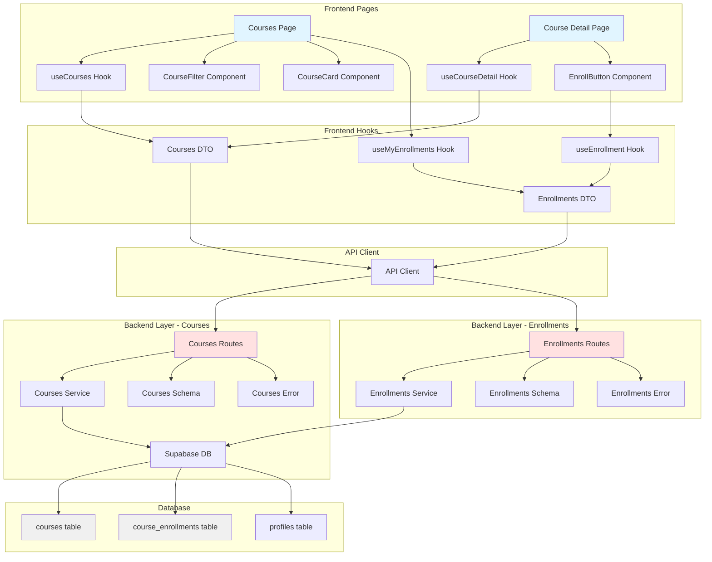
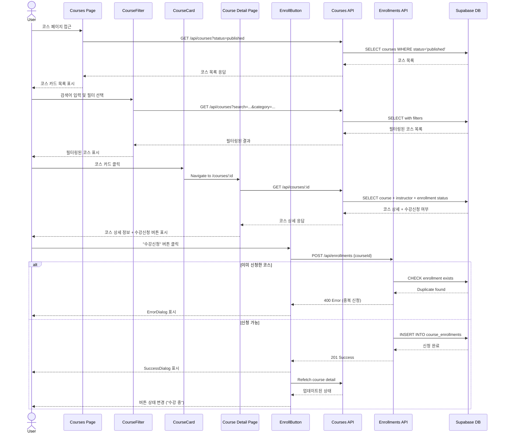

# UC-002: 코스 탐색 & 수강신청 (Learner) - Implementation Plan

## 개요

### 핵심 모듈 목록

#### Backend Layer
| 모듈 | 위치 | 설명 |
|------|------|------|
| Courses Routes | `src/features/courses/backend/route.ts` | GET /courses, GET /courses/:id 엔드포인트 |
| Courses Service | `src/features/courses/backend/service.ts` | 코스 목록/상세 조회, 수강신청 여부 확인 |
| Courses Schema | `src/features/courses/backend/schema.ts` | 코스 요청/응답 Zod 스키마 |
| Courses Error | `src/features/courses/backend/error.ts` | 코스 관련 에러 코드 |
| Enrollments Routes | `src/features/enrollments/backend/route.ts` | POST /enrollments, GET /enrollments 엔드포인트 |
| Enrollments Service | `src/features/enrollments/backend/service.ts` | 수강신청, 내 수강 목록 조회 |
| Enrollments Schema | `src/features/enrollments/backend/schema.ts` | 수강신청 요청/응답 Zod 스키마 |
| Enrollments Error | `src/features/enrollments/backend/error.ts` | 수강신청 관련 에러 코드 |

#### Frontend Layer
| 모듈 | 위치 | 설명 |
|------|------|------|
| Courses Page | `src/app/(protected)/courses/page.tsx` | 코스 목록 페이지 (검색/필터/정렬) |
| Course Detail Page | `src/app/(protected)/courses/[id]/page.tsx` | 코스 상세 페이지 |
| useCourses Hook | `src/features/courses/hooks/useCourses.ts` | 코스 목록 조회 Query 훅 |
| useCourseDetail Hook | `src/features/courses/hooks/useCourseDetail.ts` | 코스 상세 조회 Query 훅 |
| useEnrollment Hook | `src/features/enrollments/hooks/useEnrollment.ts` | 수강신청 Mutation 훅 |
| useMyEnrollments Hook | `src/features/enrollments/hooks/useMyEnrollments.ts` | 내 수강 목록 조회 Query 훅 |
| CourseCard Component | `src/features/courses/components/course-card.tsx` | 코스 카드 UI |
| CourseFilter Component | `src/features/courses/components/course-filter.tsx` | 검색/필터/정렬 UI |
| EnrollButton Component | `src/features/enrollments/components/enroll-button.tsx` | 수강신청 버튼 |
| Courses DTO | `src/features/courses/lib/dto.ts` | 클라이언트 측 스키마 재노출 |
| Enrollments DTO | `src/features/enrollments/lib/dto.ts` | 클라이언트 측 스키마 재노출 |

#### Database
| 모듈 | 위치 | 설명 |
|------|------|------|
| LMS Schema Migration | `supabase/migrations/0002_create_lms_schema.sql` | 이미 존재 (courses, course_enrollments 테이블 포함) |

---

## Diagram

### Module Relationship (Mermaid)



### Sequence Flow - 코스 탐색 및 수강신청 (Mermaid)



---

## Implementation Plan

### Phase 1: Backend Layer - Courses Feature

#### 1.1 Courses Schema

**File**: `src/features/courses/backend/schema.ts`

**Implementation**:
```typescript
import { z } from 'zod';

// 코스 목록 조회 Query Parameters
export const CourseListQuerySchema = z.object({
  search: z.string().optional(),
  category: z.string().optional(),
  level: z.string().optional(),
  sort: z.enum(['latest', 'popular']).optional().default('latest'),
  status: z.enum(['draft', 'published', 'archived']).optional().default('published'),
});

// 코스 상세 조회 Params
export const CourseParamsSchema = z.object({
  id: z.string().uuid({ message: 'Course ID must be a valid UUID.' }),
});

// 코스 응답 (목록용)
export const CourseResponseSchema = z.object({
  id: z.string().uuid(),
  title: z.string(),
  description: z.string(),
  category: z.string(),
  difficulty: z.string(),
  instructorName: z.string(),
  enrollmentCount: z.number().int().min(0),
  createdAt: z.string(),
});

// 코스 상세 응답
export const CourseDetailResponseSchema = CourseResponseSchema.extend({
  instructorId: z.string().uuid(),
  status: z.enum(['draft', 'published', 'archived']),
  publishedAt: z.string().nullable(),
  isEnrolled: z.boolean(),
});

export type CourseListQuery = z.infer<typeof CourseListQuerySchema>;
export type CourseResponse = z.infer<typeof CourseResponseSchema>;
export type CourseDetailResponse = z.infer<typeof CourseDetailResponseSchema>;
```

**Unit Test**:
- 코스 목록 쿼리 파라미터 검증
- 코스 응답 스키마 검증
- 코스 상세 응답 스키마 검증

---

#### 1.2 Courses Error Codes

**File**: `src/features/courses/backend/error.ts`

```typescript
export const courseErrorCodes = {
  fetchError: 'COURSE_FETCH_ERROR',
  notFound: 'COURSE_NOT_FOUND',
  validationError: 'COURSE_VALIDATION_ERROR',
  unauthorizedAccess: 'COURSE_UNAUTHORIZED_ACCESS',
} as const;

export type CourseServiceError = (typeof courseErrorCodes)[keyof typeof courseErrorCodes];
```

---

#### 1.3 Courses Service

**File**: `src/features/courses/backend/service.ts`

**Functions**:
- `listCourses`: 코스 목록 조회 (검색/필터/정렬 지원)
- `getCourseDetail`: 코스 상세 조회 + 수강신청 여부 확인

**Unit Test**:
- 코스 목록 조회 성공
- 검색어로 필터링
- 카테고리/난이도 필터링
- 정렬 (최신순/인기순)
- 코스 상세 조회 성공
- 존재하지 않는 코스 조회 시 404
- 수강신청 여부 올바르게 반환

---

#### 1.4 Courses Routes

**File**: `src/features/courses/backend/route.ts`

**Endpoints**:
- GET /courses - 코스 목록 조회
- GET /courses/:id - 코스 상세 조회

**Unit Test**:
- GET /courses 성공
- GET /courses with query params
- GET /courses/:id 성공
- GET /courses/:id with invalid UUID returns 400

**Hono App Registration**:
`src/backend/hono/app.ts`에 `registerCoursesRoutes(app)` 추가

---

### Phase 2: Backend Layer - Enrollments Feature

#### 2.1 Enrollments Schema

**File**: `src/features/enrollments/backend/schema.ts`

```typescript
export const EnrollmentRequestSchema = z.object({
  courseId: z.string().uuid({ message: 'Course ID must be a valid UUID.' }),
});

export const EnrollmentResponseSchema = z.object({
  id: z.string().uuid(),
  courseId: z.string().uuid(),
  learnerId: z.string().uuid(),
  enrolledAt: z.string(),
});

export const MyEnrollmentResponseSchema = z.object({
  id: z.string().uuid(),
  courseId: z.string().uuid(),
  courseTitle: z.string(),
  instructorName: z.string(),
  enrolledAt: z.string(),
});
```

---

#### 2.2 Enrollments Service

**File**: `src/features/enrollments/backend/service.ts`

**Functions**:
- `createEnrollment`: 수강신청 (중복 체크, 코스 상태 확인, 역할 확인)
- `getMyEnrollments`: 내 수강 목록 조회

**Business Rules**:
- Learner 역할만 수강신청 가능
- published 상태 코스만 신청 가능
- 중복 신청 차단 (UNIQUE constraint)

**Unit Test**:
- 수강신청 성공
- 중복 신청 시 409 에러
- draft 코스 신청 시 400 에러
- Instructor 역할 신청 시 403 에러
- 내 수강 목록 조회 성공

---

#### 2.3 Enrollments Routes

**File**: `src/features/enrollments/backend/route.ts`

**Endpoints**:
- POST /enrollments - 수강신청
- GET /enrollments - 내 수강 목록 조회

**Unit Test**:
- POST /enrollments 성공
- POST /enrollments 중복 시 409
- GET /enrollments 성공

---

### Phase 3: Frontend Layer

#### 3.1 Frontend Hooks

**Files**:
- `src/features/courses/hooks/useCourses.ts`: useQuery for course list
- `src/features/courses/hooks/useCourseDetail.ts`: useQuery for course detail
- `src/features/enrollments/hooks/useEnrollment.ts`: useMutation for enrollment
- `src/features/enrollments/hooks/useMyEnrollments.ts`: useQuery for my enrollments

---

#### 3.2 Frontend Components

**CourseCard Component** (`src/features/courses/components/course-card.tsx`):
- 코스 제목, 설명, 카테고리, 난이도, 강사명, 수강생 수 표시
- 클릭 시 상세 페이지로 이동

**QA Sheet**:
| Test Case | Expected Result |
|-----------|-----------------|
| 코스 카드 렌더링 | 모든 정보 표시 |
| 클릭 시 이동 | `/courses/:id`로 이동 |
| 배지 표시 | 카테고리, 난이도 배지 표시 |

---

**CourseFilter Component** (`src/features/courses/components/course-filter.tsx`):
- 검색어 입력
- 카테고리 선택 (Select)
- 난이도 선택 (Select)
- 정렬 선택 (최신순/인기순)

**QA Sheet**:
| Test Case | Expected Result |
|-----------|-----------------|
| 검색어 입력 | onChange 호출 |
| 카테고리 선택 | onChange 호출 |
| 필터 리셋 | 모든 필터 초기화 |

---

**EnrollButton Component** (`src/features/enrollments/components/enroll-button.tsx`):
- 미신청: "수강신청" 버튼 활성화
- 이미 신청: "수강 중" 표시 및 버튼 비활성화
- 클릭 시 수강신청 Mutation 실행
- 성공/실패 Dialog 표시

**QA Sheet**:
| Test Case | Expected Result |
|-----------|-----------------|
| 미신청 상태 | "수강신청" 버튼 활성화 |
| 신청 완료 | SuccessDialog 표시 후 상태 업데이트 |
| 중복 신청 | ErrorDialog 표시 |
| 이미 수강 중 | "수강 중" 표시, 버튼 비활성화 |

---

#### 3.3 Pages

**Courses Page** (`src/app/(protected)/courses/page.tsx`):
- 코스 목록 표시
- CourseFilter 컴포넌트
- CourseCard 목록
- 로딩/에러 상태 처리

**QA Sheet**:
| Test Case | Expected Result |
|-----------|-----------------|
| 페이지 렌더링 | 코스 목록 표시 |
| 검색 필터 적용 | 필터링된 코스 표시 |
| 카테고리 필터 | 선택한 카테고리 코스만 표시 |
| 정렬 변경 | 정렬된 코스 목록 표시 |
| 빈 결과 | "코스가 없습니다" 메시지 표시 |

---

**Course Detail Page** (`src/app/(protected)/courses/[id]/page.tsx`):
- 코스 상세 정보 표시
- 강사 정보 표시
- EnrollButton 컴포넌트
- 수강생 수 표시

**QA Sheet**:
| Test Case | Expected Result |
|-----------|-----------------|
| 페이지 렌더링 | 코스 상세 정보 표시 |
| 수강신청 버튼 | 신청 여부에 따라 상태 표시 |
| 수강신청 성공 | 버튼 상태 업데이트 |
| 존재하지 않는 코스 | 404 에러 표시 |

---

### Phase 4: Integration & Testing

#### 4.1 Shadcn-ui Components

필요한 컴포넌트 (이미 설치되어 있는지 확인):
- Badge
- Card
- Select
- Input

추가 설치가 필요한 경우:
```bash
$ npx shadcn@latest add badge
```

---

#### 4.2 Database Migration

`supabase/migrations/0002_create_lms_schema.sql`가 이미 적용되어 있는지 확인:
- `courses` 테이블
- `course_enrollments` 테이블 (UNIQUE constraint: course_id, learner_id)
- 인덱스: `idx_courses_status`, `idx_enrollments_learner`

---

#### 4.3 End-to-End Test Scenarios

**Scenario 1: 코스 탐색 및 필터링**
1. `/courses` 페이지 접근
2. 코스 목록 표시 확인
3. 검색어 입력: "React"
4. 필터링된 코스 목록 확인
5. 카테고리 선택: "프론트엔드"
6. 정렬 변경: "인기순"
7. 정렬된 코스 목록 확인

**Scenario 2: 코스 상세 조회 및 수강신청**
1. 코스 카드 클릭
2. `/courses/:id` 페이지 이동
3. 코스 상세 정보 표시 확인
4. "수강신청" 버튼 클릭
5. SuccessDialog 표시 확인
6. 버튼 상태 "수강 중"으로 변경 확인

**Scenario 3: 중복 수강신청 차단**
1. 이미 수강 중인 코스 상세 페이지 접근
2. "수강 중" 표시 확인
3. 버튼 비활성화 확인

**Scenario 4: Instructor 역할 수강신청 차단**
1. Instructor 역할로 로그인
2. 코스 상세 페이지 접근
3. 수강신청 시도
4. ErrorDialog "Instructor는 수강신청을 할 수 없습니다" 표시

---

### Phase 5: 잠재적 개선 사항

#### 5.1 무한 스크롤 (Infinite Query)

코스 목록이 많아질 경우 `@tanstack/react-query`의 `useInfiniteQuery`를 사용하여 무한 스크롤 구현

#### 5.2 코스 북마크/찜 기능

관심 있는 코스를 북마크하여 나중에 수강신청할 수 있는 기능

#### 5.3 코스 리뷰/평가

수강 완료 후 코스 리뷰 및 별점 평가 기능

#### 5.4 코스 미리보기

코스 설명 외에 샘플 강의 영상을 미리 볼 수 있는 기능

#### 5.5 알림 기능

새로운 코스 등록 시 알림 (이메일/푸시)

---

## 결론

본 구현 계획은 UC-002: 코스 탐색 & 수강신청 기능을 최소한으로 모듈화하여 설계했습니다.

**핵심 설계 원칙**:
1. **기능별 분리**: Courses와 Enrollments를 별도 feature로 분리
2. **재사용성**: CourseCard, CourseFilter, EnrollButton 컴포넌트 재사용 가능
3. **타입 안전성**: Zod 스키마를 통한 런타임 검증 및 타입 추론
4. **비즈니스 로직 강화**: 중복 신청 차단, 역할 검증, 코스 상태 확인
5. **사용자 경험**: ErrorDialog/SuccessDialog를 통한 명확한 피드백

**구현 우선순위**:
1. Phase 1 (Courses Backend) - 코스 조회 API
2. Phase 2 (Enrollments Backend) - 수강신청 API
3. Phase 3 (Frontend) - UI 및 사용자 상호작용
4. Phase 4 (Integration & Testing) - E2E 시나리오 검증

**예상 작업 시간**:
- Phase 1: 4-5시간
- Phase 2: 3-4시간
- Phase 3: 8-10시간
- Phase 4: 2-3시간
- **총 예상 시간**: 17-22시간

