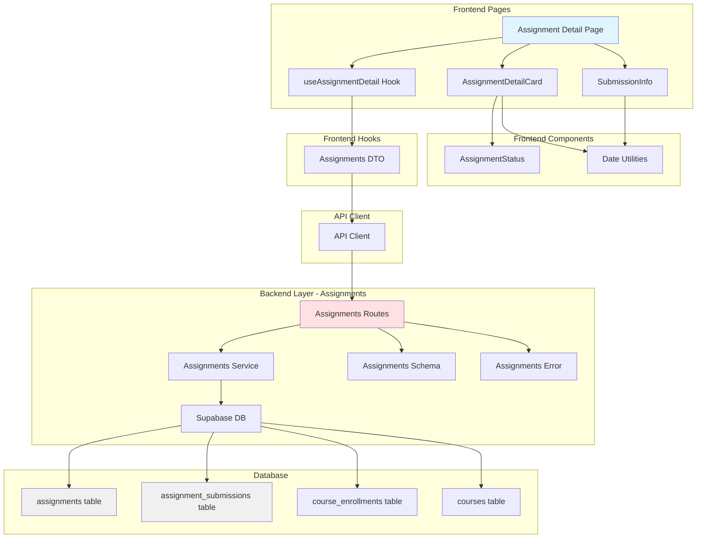

# UC-003: 과제 상세 열람 (Learner) - Implementation Plan

## 개요

### 핵심 모듈 목록

#### Backend Layer
| 모듈 | 위치 | 설명 |
|------|------|------|
| Assignments Routes | `src/features/assignments/backend/route.ts` | GET /assignments/:id 엔드포인트 |
| Assignments Service | `src/features/assignments/backend/service.ts` | 과제 상세 조회, 권한 검증, 제출 내역 확인 |
| Assignments Schema | `src/features/assignments/backend/schema.ts` | 과제 요청/응답 Zod 스키마 |
| Assignments Error | `src/features/assignments/backend/error.ts` | 과제 관련 에러 코드 |

#### Frontend Layer
| 모듈 | 위치 | 설명 |
|------|------|------|
| Assignment Detail Page | `src/app/(protected)/courses/[id]/assignments/[assignmentId]/page.tsx` | 과제 상세 페이지 |
| useAssignmentDetail Hook | `src/features/assignments/hooks/useAssignmentDetail.ts` | 과제 상세 조회 Query 훅 |
| AssignmentDetailCard Component | `src/features/assignments/components/assignment-detail-card.tsx` | 과제 정보 표시 카드 |
| AssignmentStatus Component | `src/features/assignments/components/assignment-status.tsx` | 과제 상태 배지 (draft/published/closed) |
| SubmissionInfo Component | `src/features/assignments/components/submission-info.tsx` | 제출 내역 표시 |
| Assignments DTO | `src/features/assignments/lib/dto.ts` | 클라이언트 측 스키마 재노출 |

#### Shared Utilities
| 모듈 | 위치 | 설명 |
|------|------|------|
| Date Utilities | `src/lib/utils/date.ts` | 마감일 포맷팅, 남은 시간 계산 (date-fns 활용) |

#### Database
| 모듈 | 위치 | 설명 |
|------|------|------|
| LMS Schema Migration | `supabase/migrations/0002_create_lms_schema.sql` | 이미 존재 (assignments, assignment_submissions 테이블 포함) |

---

## Diagram

### Module Relationship (Mermaid)



### Sequence Flow - 과제 상세 열람 (Mermaid)

```mermaid
sequenceDiagram
    actor User
    participant Page as Assignment Detail Page
    participant Hook as useAssignmentDetail
    participant Card as AssignmentDetailCard
    participant API as Assignments API
    participant Service as Assignments Service
    participant DB as Supabase DB
    
    User->>Page: 과제 클릭 (/courses/:id/assignments/:assignmentId)
    Page->>Hook: 과제 ID로 조회 요청
    Hook->>API: GET /api/assignments/:id
    
    API->>Service: getAssignmentDetail(assignmentId, userId)
    
    Service->>DB: SELECT enrollment WHERE learner_id = ? AND course_id = ?
    
    alt 수강 중이 아님
        DB-->>Service: No enrollment found
        Service-->>API: 403 Forbidden (권한 없음)
        API-->>Hook: Error response
        Hook-->>Page: Error state
        Page-->>User: ErrorDialog "수강 중인 코스만 열람 가능합니다"
    else 수강 중
        DB-->>Service: Enrollment found
        Service->>DB: SELECT assignment WHERE id = ?
        
        alt 과제 미존재 또는 draft
            DB-->>Service: Not found or draft
            Service-->>API: 404 Not Found
            API-->>Hook: Error response
            Hook-->>Page: Error state
            Page-->>User: ErrorDialog "과제를 찾을 수 없습니다"
        else 과제 존재 (published/closed)
            DB-->>Service: Assignment data
            Service->>DB: SELECT latest submission WHERE assignment_id = ? AND learner_id = ?
            DB-->>Service: Submission data (if exists)
            
            Service-->>API: 200 OK (과제 정보 + 제출 내역)
            API-->>Hook: Assignment detail
            Hook-->>Page: Data ready
            
            Page->>Card: Render assignment details
            Card-->>User: 과제 상세 표시
            - 제목, 설명
            - 마감일, 점수 비중
            - 지각/재제출 정책
            - 과제 상태
            
            opt 제출 내역 존재
                Page->>User: 제출 정보 표시
                - 제출일, 점수, 피드백
            end
        end
    end
```

---

## Implementation Plan

### Phase 1: Backend Layer - Assignments Feature

#### 1.1 Assignments Schema

**File**: `src/features/assignments/backend/schema.ts`

**Implementation**:
```typescript
import { z } from 'zod';

// 과제 조회 Params
export const AssignmentParamsSchema = z.object({
  id: z.string().uuid({ message: 'Assignment ID must be a valid UUID.' }),
});

// 제출 내역 스키마
export const SubmissionDetailSchema = z.object({
  id: z.string().uuid(),
  version: z.number().int(),
  status: z.enum(['submitted', 'graded', 'resubmission_required']),
  late: z.boolean(),
  submittedAt: z.string(),
  contentText: z.string(),
  contentLink: z.string().nullable(),
  score: z.number().nullable(),
  feedback: z.string().nullable(),
  gradedAt: z.string().nullable(),
});

// 과제 상세 응답
export const AssignmentDetailResponseSchema = z.object({
  id: z.string().uuid(),
  courseId: z.string().uuid(),
  courseTitle: z.string(),
  title: z.string(),
  description: z.string(),
  status: z.enum(['draft', 'published', 'closed']),
  dueAt: z.string(),
  scoreWeight: z.number(),
  allowLate: z.boolean(),
  allowResubmission: z.boolean(),
  publishedAt: z.string().nullable(),
  closedAt: z.string().nullable(),
  submission: SubmissionDetailSchema.nullable(),
});

export type AssignmentParams = z.infer<typeof AssignmentParamsSchema>;
export type SubmissionDetail = z.infer<typeof SubmissionDetailSchema>;
export type AssignmentDetailResponse = z.infer<typeof AssignmentDetailResponseSchema>;
```

**Unit Test**:
- 과제 Params UUID 검증
- 제출 내역 스키마 검증
- 과제 상세 응답 스키마 검증

---

#### 1.2 Assignments Error Codes

**File**: `src/features/assignments/backend/error.ts`

```typescript
export const assignmentErrorCodes = {
  fetchError: 'ASSIGNMENT_FETCH_ERROR',
  notFound: 'ASSIGNMENT_NOT_FOUND',
  validationError: 'ASSIGNMENT_VALIDATION_ERROR',
  unauthorizedAccess: 'ASSIGNMENT_UNAUTHORIZED_ACCESS',
  notEnrolled: 'ASSIGNMENT_NOT_ENROLLED',
  notPublished: 'ASSIGNMENT_NOT_PUBLISHED',
} as const;

export type AssignmentServiceError = 
  (typeof assignmentErrorCodes)[keyof typeof assignmentErrorCodes];
```

---

#### 1.3 Assignments Service

**File**: `src/features/assignments/backend/service.ts`

**Functions**:
- `getAssignmentDetail`: 과제 상세 조회 + 권한 검증 + 제출 내역 조회

**Business Logic**:
1. 사용자가 해당 코스에 수강신청되어 있는지 확인 (`course_enrollments` 조회)
2. 과제가 존재하고 `published` 또는 `closed` 상태인지 확인 (`draft`는 학습자에게 노출 안 함)
3. 해당 학습자의 최신 제출 내역 조회 (`is_latest = true`)
4. 모든 정보를 조합하여 반환

**Implementation Outline**:
```typescript
import type { SupabaseClient } from '@supabase/supabase-js';
import type { Database } from '@/lib/supabase/types';
import { assignmentErrorCodes } from './error';
import { failure, success, type HandlerResult } from '@/backend/http/response';

type ServiceResult<T> = HandlerResult<T, string, unknown>;

export interface AssignmentDetail {
  id: string;
  courseId: string;
  courseTitle: string;
  title: string;
  description: string;
  status: string;
  dueAt: string;
  scoreWeight: number;
  allowLate: boolean;
  allowResubmission: boolean;
  publishedAt: string | null;
  closedAt: string | null;
  submission: SubmissionDetail | null;
}

export interface SubmissionDetail {
  id: string;
  version: number;
  status: string;
  late: boolean;
  submittedAt: string;
  contentText: string;
  contentLink: string | null;
  score: number | null;
  feedback: string | null;
  gradedAt: string | null;
}

export const getAssignmentDetail = async (
  supabase: SupabaseClient<Database>,
  assignmentId: string,
  userId: string
): Promise<ServiceResult<AssignmentDetail>> => {
  try {
    // 1. 과제 정보 조회
    const { data: assignment, error: assignmentError } = await supabase
      .from('assignments')
      .select(`
        *,
        course:courses(id, title, instructor_id)
      `)
      .eq('id', assignmentId)
      .single();

    if (assignmentError || !assignment) {
      return failure(
        404,
        assignmentErrorCodes.notFound,
        'Assignment not found'
      );
    }

    const assignmentData = assignment as any;
    const course = assignmentData.course;

    // 2. 수강신청 확인 (권한 검증)
    const { data: enrollment } = await supabase
      .from('course_enrollments')
      .select('id')
      .eq('course_id', course.id)
      .eq('learner_id', userId)
      .single();

    if (!enrollment) {
      return failure(
        403,
        assignmentErrorCodes.notEnrolled,
        'You are not enrolled in this course'
      );
    }

    // 3. draft 상태 과제는 학습자에게 비공개
    if (assignmentData.status === 'draft') {
      return failure(
        404,
        assignmentErrorCodes.notPublished,
        'Assignment is not published yet'
      );
    }

    // 4. 최신 제출 내역 조회
    const { data: submission } = await supabase
      .from('assignment_submissions')
      .select('*')
      .eq('assignment_id', assignmentId)
      .eq('learner_id', userId)
      .eq('is_latest', true)
      .single();

    const submissionDetail: SubmissionDetail | null = submission
      ? {
          id: submission.id,
          version: submission.version,
          status: submission.status,
          late: submission.late,
          submittedAt: submission.submitted_at,
          contentText: submission.content_text,
          contentLink: submission.content_link,
          score: submission.score,
          feedback: submission.feedback,
          gradedAt: submission.graded_at,
        }
      : null;

    const assignmentDetail: AssignmentDetail = {
      id: assignmentData.id,
      courseId: course.id,
      courseTitle: course.title,
      title: assignmentData.title,
      description: assignmentData.description,
      status: assignmentData.status,
      dueAt: assignmentData.due_at,
      scoreWeight: assignmentData.score_weight,
      allowLate: assignmentData.allow_late,
      allowResubmission: assignmentData.allow_resubmission,
      publishedAt: assignmentData.published_at,
      closedAt: assignmentData.closed_at,
      submission: submissionDetail,
    };

    return success(assignmentDetail);
  } catch (err) {
    return failure(
      500,
      assignmentErrorCodes.fetchError,
      err instanceof Error ? err.message : 'Unknown error'
    );
  }
};
```

**Unit Test**:
- 과제 상세 조회 성공 (제출 내역 없음)
- 과제 상세 조회 성공 (제출 내역 있음)
- 수강신청하지 않은 코스의 과제 조회 시 403
- draft 상태 과제 조회 시 404
- 존재하지 않는 과제 조회 시 404

---

#### 1.4 Assignments Routes

**File**: `src/features/assignments/backend/route.ts`

**Endpoints**:
- GET /assignments/:id - 과제 상세 조회

**Implementation**:
```typescript
import { Hono } from 'hono';
import type { AppEnv } from '@/backend/hono/context';
import { AssignmentParamsSchema } from './schema';
import { getAssignmentDetail } from './service';
import { respond, failure } from '@/backend/http/response';
import { assignmentErrorCodes } from './error';

export const registerAssignmentsRoutes = (app: Hono<AppEnv>) => {
  const assignmentsRouter = new Hono<AppEnv>();

  assignmentsRouter.get('/:id', async (c) => {
    const supabase = c.get('supabase');
    const id = c.req.param('id');

    const parsedParams = AssignmentParamsSchema.safeParse({ id });

    if (!parsedParams.success) {
      return respond(
        c,
        failure(400, assignmentErrorCodes.validationError, '잘못된 과제 ID입니다.')
      );
    }

    const { data: userData, error: authError } = await supabase.auth.getUser();

    if (authError || !userData.user) {
      return c.json(
        { success: false, error: 'Unauthorized', code: 'UNAUTHORIZED' },
        401
      );
    }

    const result = await getAssignmentDetail(
      supabase,
      parsedParams.data.id,
      userData.user.id
    );

    return respond(c, result);
  });

  app.route('/assignments', assignmentsRouter);
};
```

**Unit Test**:
- GET /assignments/:id 성공
- GET /assignments/:id with invalid UUID returns 400
- GET /assignments/:id unauthorized returns 401
- GET /assignments/:id not enrolled returns 403

**Hono App Registration**:
`src/backend/hono/app.ts`에 `registerAssignmentsRoutes(app)` 추가

---

### Phase 2: Frontend Layer

#### 2.1 Date Utilities

**File**: `src/lib/utils/date.ts`

**Functions**:
- `formatDueDate`: 마감일을 "YYYY년 MM월 DD일 HH:mm" 형태로 포맷
- `getDueDateStatus`: 마감일 상태 계산 ("지남", "오늘", "D-N일")
- `isOverdue`: 마감일이 지났는지 확인

**Implementation**:
```typescript
import { format, differenceInDays, isPast, isToday } from 'date-fns';
import { ko } from 'date-fns/locale';

export const formatDueDate = (dateString: string): string => {
  const date = new Date(dateString);
  return format(date, 'yyyy년 MM월 dd일 HH:mm', { locale: ko });
};

export const getDueDateStatus = (dateString: string): string => {
  const date = new Date(dateString);
  
  if (isPast(date)) {
    return '마감됨';
  }
  
  if (isToday(date)) {
    return '오늘 마감';
  }
  
  const daysLeft = differenceInDays(date, new Date());
  return `D-${daysLeft}일`;
};

export const isOverdue = (dateString: string): boolean => {
  const date = new Date(dateString);
  return isPast(date);
};
```

---

#### 2.2 Frontend Hooks

**File**: `src/features/assignments/hooks/useAssignmentDetail.ts`

**Implementation**:
```typescript
import { useQuery } from '@tanstack/react-query';
import { apiClient } from '@/lib/remote/api-client';
import type { AssignmentDetailResponse } from '../lib/dto';

export const useAssignmentDetail = (assignmentId: string) => {
  return useQuery({
    queryKey: ['assignment', assignmentId],
    queryFn: async () => {
      const response = await apiClient.get<AssignmentDetailResponse>(
        `/assignments/${assignmentId}`
      );

      return response.data;
    },
    enabled: !!assignmentId,
    retry: 1,
  });
};
```

**File**: `src/features/assignments/lib/dto.ts`

```typescript
export type {
  AssignmentDetailResponse,
  SubmissionDetail,
} from '../backend/schema';
```

---

#### 2.3 Frontend Components

**AssignmentStatus Component** (`src/features/assignments/components/assignment-status.tsx`):

```typescript
'use client';

import { Badge } from '@/components/ui/badge';
import { match } from 'ts-pattern';

interface AssignmentStatusProps {
  status: 'draft' | 'published' | 'closed';
}

export const AssignmentStatus = ({ status }: AssignmentStatusProps) => {
  const { label, variant } = match(status)
    .with('draft', () => ({ label: '작성 중', variant: 'secondary' as const }))
    .with('published', () => ({ label: '진행 중', variant: 'default' as const }))
    .with('closed', () => ({ label: '마감됨', variant: 'destructive' as const }))
    .exhaustive();

  return <Badge variant={variant}>{label}</Badge>;
};
```

**QA Sheet**:
| Test Case | Expected Result |
|-----------|-----------------|
| status='published' | "진행 중" 배지 (default variant) |
| status='closed' | "마감됨" 배지 (destructive variant) |
| status='draft' | "작성 중" 배지 (secondary variant) |

---

**SubmissionInfo Component** (`src/features/assignments/components/submission-info.tsx`):

```typescript
'use client';

import { Card, CardContent, CardHeader, CardTitle } from '@/components/ui/card';
import { Badge } from '@/components/ui/badge';
import { formatDueDate } from '@/lib/utils/date';
import type { SubmissionDetail } from '../lib/dto';
import { match } from 'ts-pattern';

interface SubmissionInfoProps {
  submission: SubmissionDetail;
}

export const SubmissionInfo = ({ submission }: SubmissionInfoProps) => {
  const statusLabel = match(submission.status)
    .with('submitted', () => '제출 완료')
    .with('graded', () => '채점 완료')
    .with('resubmission_required', () => '재제출 필요')
    .exhaustive();

  const statusVariant = match(submission.status)
    .with('submitted', () => 'default' as const)
    .with('graded', () => 'default' as const)
    .with('resubmission_required', () => 'destructive' as const)
    .exhaustive();

  return (
    <Card>
      <CardHeader>
        <CardTitle className="flex items-center justify-between">
          <span>제출 내역</span>
          <Badge variant={statusVariant}>{statusLabel}</Badge>
        </CardTitle>
      </CardHeader>
      <CardContent className="space-y-3">
        <div>
          <p className="text-sm text-muted-foreground">제출일</p>
          <p className="font-medium">{formatDueDate(submission.submittedAt)}</p>
          {submission.late && (
            <Badge variant="destructive" className="mt-1">지각 제출</Badge>
          )}
        </div>

        <div>
          <p className="text-sm text-muted-foreground">제출 내용</p>
          <p className="whitespace-pre-wrap">{submission.contentText}</p>
          {submission.contentLink && (
            <a
              href={submission.contentLink}
              target="_blank"
              rel="noopener noreferrer"
              className="text-blue-600 hover:underline text-sm mt-1 block"
            >
              첨부 링크
            </a>
          )}
        </div>

        {submission.status === 'graded' && (
          <>
            <div>
              <p className="text-sm text-muted-foreground">점수</p>
              <p className="text-2xl font-bold">{submission.score}점</p>
            </div>

            {submission.feedback && (
              <div>
                <p className="text-sm text-muted-foreground">피드백</p>
                <p className="whitespace-pre-wrap">{submission.feedback}</p>
              </div>
            )}

            <div>
              <p className="text-sm text-muted-foreground">채점일</p>
              <p className="text-sm">
                {submission.gradedAt ? formatDueDate(submission.gradedAt) : '-'}
              </p>
            </div>
          </>
        )}

        {submission.status === 'resubmission_required' && (
          <div className="p-3 bg-yellow-50 border border-yellow-200 rounded">
            <p className="text-sm text-yellow-800">
              재제출이 필요합니다. 피드백을 확인하고 다시 제출해주세요.
            </p>
          </div>
        )}
      </CardContent>
    </Card>
  );
};
```

**QA Sheet**:
| Test Case | Expected Result |
|-----------|-----------------|
| 제출 완료 상태 | "제출 완료" 배지, 제출일/내용 표시 |
| 채점 완료 상태 | 점수, 피드백, 채점일 표시 |
| 재제출 필요 상태 | "재제출 필요" 배지, 안내 메시지 표시 |
| 지각 제출 | "지각 제출" 배지 표시 |
| 첨부 링크 있음 | 링크 버튼 표시 |

---

**AssignmentDetailCard Component** (`src/features/assignments/components/assignment-detail-card.tsx`):

```typescript
'use client';

import { Card, CardContent, CardHeader, CardTitle } from '@/components/ui/card';
import { Separator } from '@/components/ui/separator';
import { Badge } from '@/components/ui/badge';
import { Calendar, Weight, CheckCircle, XCircle } from 'lucide-react';
import { AssignmentStatus } from './assignment-status';
import { formatDueDate, getDueDateStatus, isOverdue } from '@/lib/utils/date';
import type { AssignmentDetailResponse } from '../lib/dto';

interface AssignmentDetailCardProps {
  assignment: AssignmentDetailResponse;
}

export const AssignmentDetailCard = ({ assignment }: AssignmentDetailCardProps) => {
  const dueStatus = getDueDateStatus(assignment.dueAt);
  const overdue = isOverdue(assignment.dueAt);
  const canSubmit = 
    assignment.status === 'published' && 
    (!overdue || assignment.allowLate);

  return (
    <Card>
      <CardHeader>
        <div className="flex items-start justify-between">
          <div>
            <p className="text-sm text-muted-foreground">{assignment.courseTitle}</p>
            <CardTitle className="text-2xl mt-1">{assignment.title}</CardTitle>
          </div>
          <AssignmentStatus status={assignment.status} />
        </div>
      </CardHeader>
      
      <CardContent className="space-y-4">
        {/* 과제 설명 */}
        <div>
          <p className="text-sm font-semibold text-muted-foreground mb-2">과제 설명</p>
          <div 
            className="prose prose-sm max-w-none"
            dangerouslySetInnerHTML={{ __html: assignment.description }}
          />
        </div>

        <Separator />

        {/* 과제 정보 그리드 */}
        <div className="grid grid-cols-2 gap-4">
          <div className="space-y-1">
            <div className="flex items-center gap-2 text-sm text-muted-foreground">
              <Calendar className="h-4 w-4" />
              <span>마감일</span>
            </div>
            <p className="font-medium">{formatDueDate(assignment.dueAt)}</p>
            <Badge variant={overdue ? 'destructive' : 'default'}>
              {dueStatus}
            </Badge>
          </div>

          <div className="space-y-1">
            <div className="flex items-center gap-2 text-sm text-muted-foreground">
              <Weight className="h-4 w-4" />
              <span>점수 비중</span>
            </div>
            <p className="font-medium">{assignment.scoreWeight}%</p>
          </div>
        </div>

        <Separator />

        {/* 제출 정책 */}
        <div>
          <p className="text-sm font-semibold text-muted-foreground mb-2">제출 정책</p>
          <div className="space-y-2">
            <div className="flex items-center gap-2">
              {assignment.allowLate ? (
                <CheckCircle className="h-4 w-4 text-green-600" />
              ) : (
                <XCircle className="h-4 w-4 text-red-600" />
              )}
              <span className="text-sm">
                {assignment.allowLate ? '지각 제출 허용' : '지각 제출 불가'}
              </span>
            </div>

            <div className="flex items-center gap-2">
              {assignment.allowResubmission ? (
                <CheckCircle className="h-4 w-4 text-green-600" />
              ) : (
                <XCircle className="h-4 w-4 text-red-600" />
              )}
              <span className="text-sm">
                {assignment.allowResubmission ? '재제출 허용' : '재제출 불가'}
              </span>
            </div>
          </div>
        </div>

        {/* 제출 가능 여부 안내 */}
        {assignment.status === 'closed' && (
          <div className="p-3 bg-gray-50 border rounded">
            <p className="text-sm text-gray-700">
              이 과제는 마감되었습니다. 더 이상 제출할 수 없습니다.
            </p>
          </div>
        )}

        {assignment.status === 'published' && overdue && !assignment.allowLate && (
          <div className="p-3 bg-red-50 border border-red-200 rounded">
            <p className="text-sm text-red-800">
              마감일이 지났습니다. 지각 제출이 허용되지 않습니다.
            </p>
          </div>
        )}

        {canSubmit && !assignment.submission && (
          <div className="p-3 bg-blue-50 border border-blue-200 rounded">
            <p className="text-sm text-blue-800">
              과제를 제출할 수 있습니다. 아래에서 제출해주세요.
            </p>
          </div>
        )}
      </CardContent>
    </Card>
  );
};
```

**QA Sheet**:
| Test Case | Expected Result |
|-----------|-----------------|
| 과제 정보 렌더링 | 제목, 설명, 마감일, 점수 비중 표시 |
| 지각 허용 정책 | 체크/X 아이콘과 함께 표시 |
| 재제출 허용 정책 | 체크/X 아이콘과 함께 표시 |
| 마감 전 과제 | D-N일 배지 표시 |
| 마감된 과제 | "마감됨" 배지 + 안내 메시지 |
| HTML 설명 렌더링 | dangerouslySetInnerHTML로 렌더링 |

---

#### 2.4 Pages

**Assignment Detail Page** (`src/app/(protected)/courses/[id]/assignments/[assignmentId]/page.tsx`):

```typescript
'use client';

import { use } from 'react';
import { useAssignmentDetail } from '@/features/assignments/hooks/useAssignmentDetail';
import { AssignmentDetailCard } from '@/features/assignments/components/assignment-detail-card';
import { SubmissionInfo } from '@/features/assignments/components/submission-info';
import { ErrorDialog } from '@/components/ui/error-dialog';
import { extractApiErrorMessage } from '@/lib/remote/api-client';
import { Loader2 } from 'lucide-react';

interface AssignmentDetailPageProps {
  params: Promise<{
    id: string;
    assignmentId: string;
  }>;
}

export default function AssignmentDetailPage({ params }: AssignmentDetailPageProps) {
  const resolvedParams = use(params);
  const { data: assignment, isLoading, error } = useAssignmentDetail(
    resolvedParams.assignmentId
  );

  if (isLoading) {
    return (
      <div className="flex justify-center items-center min-h-[400px]">
        <Loader2 className="h-8 w-8 animate-spin text-primary" />
      </div>
    );
  }

  if (error) {
    return (
      <ErrorDialog
        open={true}
        title="과제 조회 실패"
        message={extractApiErrorMessage(error, '과제를 불러올 수 없습니다.')}
        onClose={() => window.history.back()}
      />
    );
  }

  if (!assignment) {
    return (
      <div className="text-center py-12">
        <p className="text-muted-foreground">과제를 찾을 수 없습니다.</p>
      </div>
    );
  }

  return (
    <div className="container max-w-4xl mx-auto py-8 space-y-6">
      <AssignmentDetailCard assignment={assignment} />
      
      {assignment.submission && (
        <SubmissionInfo submission={assignment.submission} />
      )}

      {/* 제출 폼은 다음 유스케이스에서 구현 예정 */}
      {!assignment.submission && assignment.status === 'published' && (
        <div className="p-6 border rounded-lg">
          <p className="text-center text-muted-foreground">
            제출 기능은 다음 유스케이스에서 구현 예정입니다.
          </p>
        </div>
      )}
    </div>
  );
}
```

**QA Sheet**:
| Test Case | Expected Result |
|-----------|-----------------|
| 페이지 렌더링 | 과제 상세 정보 표시 |
| 로딩 상태 | 스피너 표시 |
| 에러 발생 | ErrorDialog 표시 |
| 제출 내역 있음 | SubmissionInfo 컴포넌트 표시 |
| 제출 내역 없음 | 제출 안내 메시지 표시 |
| 권한 없음 (403) | "수강 중인 코스만 열람 가능합니다" |
| 과제 없음 (404) | "과제를 찾을 수 없습니다" |

---

### Phase 3: Integration

#### 3.1 Hono App Registration

**File**: `src/backend/hono/app.ts`

기존 라우터 등록 부분에 다음 추가:

```typescript
import { registerAssignmentsRoutes } from '@/features/assignments/backend/route';

// 기존 라우터 등록 후
registerAssignmentsRoutes(app);
```

---

#### 3.2 Shadcn-ui Components

필요한 컴포넌트 (이미 설치되어 있는지 확인):
- Badge ✅
- Card ✅
- Separator ✅

추가 설치가 필요한 경우:
```bash
$ npx shadcn@latest add separator
```

---

#### 3.3 Date Utilities 패키지

`date-fns`는 이미 설치되어 있으므로 추가 설치 불필요.

---

### Phase 4: Testing

#### 4.1 Backend Unit Tests

**Service Tests** (`src/features/assignments/backend/service.test.ts`):
- ✅ 과제 상세 조회 성공 (제출 내역 없음)
- ✅ 과제 상세 조회 성공 (제출 내역 있음)
- ✅ 수강신청하지 않은 코스의 과제 조회 시 403
- ✅ draft 상태 과제 조회 시 404
- ✅ 존재하지 않는 과제 조회 시 404

**Route Tests** (`src/features/assignments/backend/route.test.ts`):
- ✅ GET /assignments/:id 성공
- ✅ GET /assignments/:id with invalid UUID returns 400
- ✅ GET /assignments/:id unauthorized returns 401

---

#### 4.2 Frontend Integration Tests

**Scenario 1: 과제 상세 열람 (제출 내역 없음)**
1. 학습자로 로그인
2. 수강 중인 코스 선택
3. 과제 목록에서 과제 클릭
4. `/courses/:id/assignments/:assignmentId` 이동
5. 과제 상세 정보 표시 확인:
   - 과제 제목, 설명
   - 마감일, 점수 비중
   - 지각/재제출 정책
   - 과제 상태 배지
6. 제출 내역이 없으므로 "제출 가능" 안내 메시지 표시

**Scenario 2: 과제 상세 열람 (제출 내역 있음)**
1. 이미 제출한 과제 선택
2. 과제 상세 정보와 함께 제출 내역 표시 확인:
   - 제출일시
   - 제출 내용
   - 채점 완료 시 점수/피드백
3. 재제출 불가 정책인 경우 제출 폼 비표시

**Scenario 3: 권한 없음 (수강하지 않은 코스)**
1. 수강하지 않은 코스의 과제 URL 직접 접근
2. ErrorDialog "수강 중인 코스만 열람 가능합니다" 표시
3. 뒤로가기 버튼 동작 확인

**Scenario 4: draft 상태 과제 접근**
1. draft 상태 과제 URL 직접 접근
2. ErrorDialog "과제를 찾을 수 없습니다" 표시

**Scenario 5: 마감된 과제**
1. closed 상태 또는 마감일 지난 과제 선택
2. "마감됨" 배지 표시
3. "더 이상 제출할 수 없습니다" 안내 메시지 표시

---

### Phase 5: 잠재적 개선 사항

#### 5.1 과제 목록 페이지

현재는 과제 상세 페이지만 구현하지만, 추후 코스 내 과제 목록 페이지 추가 가능:
- `/courses/:id/assignments` 페이지
- 과제 목록 카드 뷰
- 제출 상태별 필터링

#### 5.2 과제 검색 및 정렬

과제 목록에서 검색/정렬 기능:
- 제목 검색
- 마감일 순 정렬
- 제출 상태별 필터 (미제출/제출 완료/채점 완료)

#### 5.3 알림 기능

과제 관련 알림:
- 마감 D-3일 알림
- 채점 완료 알림
- 재제출 요청 알림

#### 5.4 과제 설명 Markdown 지원

현재는 HTML만 지원하지만, Markdown 파싱 추가 가능:
- `react-markdown` 라이브러리 활용
- 코드 블록 syntax highlighting

#### 5.5 제출 히스토리 보기

재제출이 허용된 경우, 과거 제출 내역 전체 보기:
- 버전별 제출 내역
- 점수 변화 그래프

---

## 결론

본 구현 계획은 UC-003: 과제 상세 열람 (Learner) 기능을 최소한으로 모듈화하여 설계했습니다.

**핵심 설계 원칙**:
1. **권한 검증 우선**: 수강신청 여부를 먼저 확인하여 보안 강화
2. **비즈니스 룰 준수**: draft 상태 과제는 학습자에게 비공개
3. **제출 상태 관리**: 최신 제출 내역(`is_latest = true`)만 조회하여 성능 최적화
4. **조건부 UI**: 과제 상태, 마감일, 제출 내역에 따라 동적 UI 표시
5. **재사용 가능한 컴포넌트**: AssignmentStatus, SubmissionInfo 등 독립적 컴포넌트 설계
6. **날짜 유틸리티**: date-fns를 활용한 일관된 날짜 처리

**구현 우선순위**:
1. Phase 1 (Backend) - 과제 조회 API + 권한 검증
2. Phase 2 (Frontend Utilities) - Date utilities, DTO
3. Phase 3 (Frontend Components) - 재사용 가능한 컴포넌트
4. Phase 4 (Frontend Pages) - 과제 상세 페이지
5. Phase 5 (Integration & Testing) - E2E 시나리오 검증

**예상 작업 시간**:
- Phase 1 (Backend): 3-4시간
- Phase 2 (Date Utilities): 1시간
- Phase 3 (Components): 4-5시간
- Phase 4 (Pages): 2-3시간
- Phase 5 (Testing): 2-3시간
- **총 예상 시간**: 12-16시간

**다음 유스케이스와의 연계**:
- UC-004: 과제 제출 (Learner) - 본 유스케이스에서 제출 폼 컴포넌트를 추가로 구현
- UC-005: 과제 채점 (Instructor) - 제출 내역 조회 로직 재사용 가능

**공통 모듈 재사용**:
- `date.ts` 유틸리티는 향후 모든 날짜 관련 기능에서 재사용
- `AssignmentStatus` 컴포넌트는 과제 목록, Instructor 대시보드에서도 재사용
- `SubmissionInfo` 컴포넌트는 Instructor의 채점 페이지에서도 활용 가능


