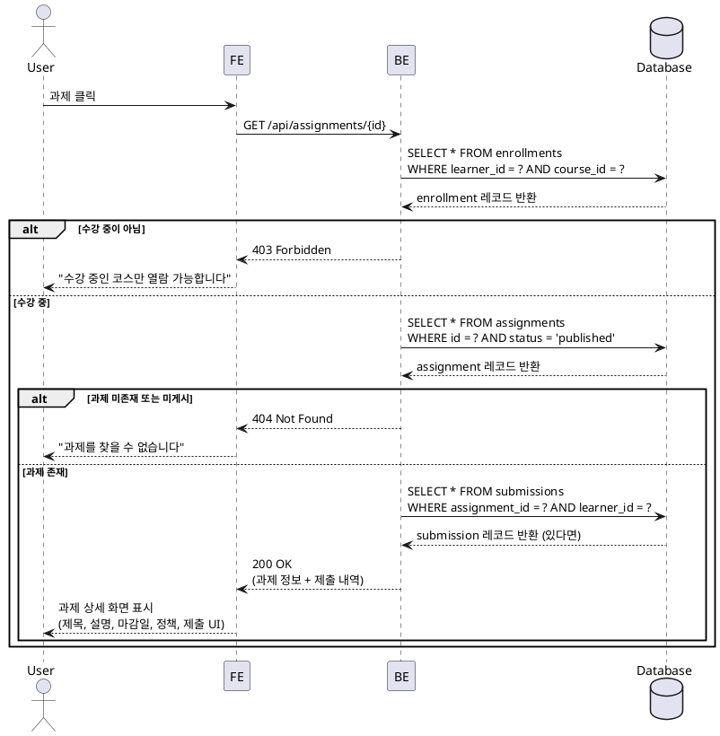

# Use Case 003: 과제 상세 열람 (Learner)

## Primary Actor
- Learner (학습자)

## Precondition
- 학습자가 로그인된 상태
- 하나 이상의 코스에 수강신청(enrollment)이 완료된 상태
- 해당 코스에 과제(Assignment)가 생성되어 있음

## Trigger
학습자가 수강 중인 코스의 과제 목록에서 특정 과제를 클릭

## Main Scenario

1. 학습자가 대시보드에서 "내 코스" 목록을 확인
2. 특정 코스를 선택하여 코스 상세 페이지로 이동
3. 코스 상세 페이지에서 "과제(Assignments)" 탭을 선택
4. 과제 목록에서 열람할 과제를 클릭
5. 시스템이 과제 접근 권한을 검증 (본인 수강 여부 확인)
6. 시스템이 과제 상태를 확인 (`published` 여부)
7. 과제 상세 정보를 화면에 표시:
   - 과제 제목
   - 과제 설명 (HTML/Markdown 포맷 지원)
   - 마감일 (due date)
   - 점수 비중 (weight)
   - 지각 허용 여부 (allow late submission)
   - 재제출 허용 여부 (allow resubmission)
8. 과제 상태에 따라 제출 UI를 조건부로 표시:
   - `published` 상태이고 마감 전: 제출 폼 활성화
   - `closed` 상태 또는 마감 후(지각 불허): 제출 버튼 비활성화 및 안내 메시지 표시
9. 이미 제출한 과제인 경우 제출 내역을 함께 표시 (제출일, 점수, 피드백)

## Edge Cases

### 1. 권한 없음
- **상황**: 학습자가 수강신청하지 않은 코스의 과제에 접근 시도
- **처리**: 403 Forbidden 에러 반환, "수강 중인 코스만 열람 가능합니다" 메시지 표시

### 2. 과제 미게시 상태
- **상황**: 과제가 `draft` 상태인 경우
- **처리**: 404 Not Found 또는 "아직 공개되지 않은 과제입니다" 메시지 표시

### 3. 과제 삭제됨
- **상황**: 과제가 삭제되었거나 존재하지 않는 ID로 접근
- **처리**: 404 Not Found 에러 반환, "과제를 찾을 수 없습니다" 메시지 표시

### 4. 네트워크 오류
- **상황**: API 호출 중 네트워크 오류 발생
- **처리**: 재시도 옵션과 함께 에러 다이얼로그 표시

### 5. 마감일 경계 케이스
- **상황**: 사용자가 과제를 열람하는 중에 마감일이 도래
- **처리**: 실시간으로 UI 업데이트는 하지 않으며, 제출 시점에 서버에서 마감일 검증

## Business Rules

### BR-001: 과제 접근 권한
- 학습자는 본인이 수강신청한 코스의 과제만 열람 가능
- `enrollments` 테이블에 `(learner_id, course_id)` 레코드 존재 여부로 검증

### BR-002: 과제 공개 상태
- `status = 'published'` 상태의 과제만 학습자에게 노출
- `draft` 또는 `closed` 상태 과제는 목록에 표시되되, 상태에 따른 UI 처리:
  - `draft`: 학습자에게는 비공개 (Instructor만 접근)
  - `closed`: 열람 가능하나 제출 불가, "마감됨" 표시

### BR-003: 제출 UI 활성화 조건
- 과제 상태가 `published`
- 마감일 전이거나, 마감일 후이나 `allow_late_submission = true`인 경우
- 재제출 불허(`allow_resubmission = false`)인 경우, 이미 제출한 학습자는 제출 폼 비활성화

### BR-004: 과제 정보 표시
- 모든 과제 필드는 Instructor가 생성 시 입력한 값을 그대로 표시
- 마감일은 학습자의 로컬 타임존으로 변환하여 표시
- 점수 비중은 백분율(%) 형태로 표시

### BR-005: 제출 내역 표시
- 학습자가 이미 제출한 과제인 경우:
  - 제출일시 표시
  - 제출 내용(text, link) 읽기 전용으로 표시
  - 채점 완료 시 점수와 피드백 표시
  - 재제출 요청 상태(`resubmission_required`)인 경우, 재제출 가능 안내 표시

---

## Sequence Diagram

