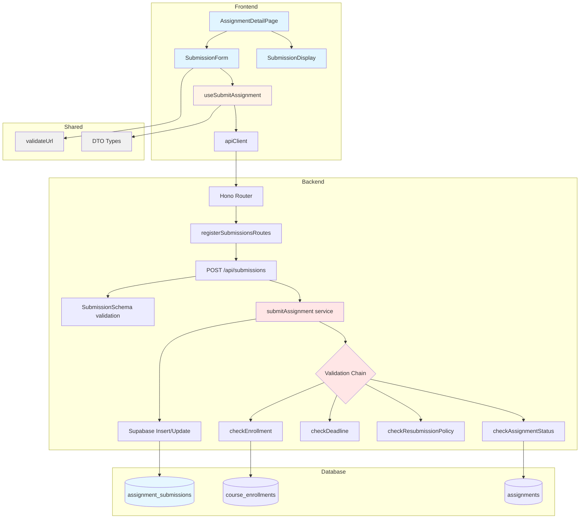

# UC-004: 과제 제출 (Learner) - Implementation Plan

## 개요

### 목표
Learner가 수강 중인 코스의 과제를 제출하고, 제출 가능 여부를 검증하며, 재제출 및 지각 제출 정책을 준수하는 기능 구현

### 구현할 모듈 목록

#### 1. Backend Layer
- **`src/features/submissions/backend/service.ts`**  
  과제 제출 비즈니스 로직 (검증, 생성/업데이트, 조회)
  
- **`src/features/submissions/backend/route.ts`**  
  Hono 라우터 정의 (`POST /api/submissions`)
  
- **`src/features/submissions/backend/schema.ts`**  
  Zod 기반 요청/응답 스키마 정의
  
- **`src/features/submissions/backend/error.ts`**  
  에러 코드 정의

#### 2. Frontend Layer (Components)
- **`src/features/submissions/components/submission-form.tsx`**  
  과제 제출 폼 컴포넌트 (Text, Link 필드, 유효성 검증)
  
- **`src/features/submissions/components/submission-display.tsx`**  
  제출 내역 표시 컴포넌트 (제출 상태, 지각 여부, 재제출 정보)

#### 3. Frontend Layer (Hooks)
- **`src/features/submissions/hooks/useSubmitAssignment.ts`**  
  React Query mutation 훅 (제출 요청)

#### 4. Frontend Layer (DTO)
- **`src/features/submissions/lib/dto.ts`**  
  클라이언트 측 DTO 재노출 (schema에서 import)

#### 5. Shared Utilities
- **`src/lib/validation/url.ts`**  
  URL 형식 검증 유틸리티 (http/https 프로토콜 확인)

#### 6. Page Integration
- **`src/app/(protected)/courses/[id]/assignments/[assignmentId]/page.tsx`** (수정)  
  기존 페이지에 제출 폼 통합

#### 7. Hono App Registration
- **`src/backend/hono/app.ts`** (수정)  
  submissions 라우터 등록

---

## Diagram



---

## Implementation Plan

### 1. Backend: Submission Service (`src/features/submissions/backend/service.ts`)

#### 책임
- 과제 제출 가능 여부 검증 (코스 등록, 과제 상태, 마감일, 재제출 정책)
- 제출 레코드 생성 또는 업데이트
- 제출 이력 조회

#### 주요 함수

##### `submitAssignment`
```typescript
async (
  supabase: SupabaseClient<Database>,
  userId: string,
  input: SubmitAssignmentInput
): Promise<ServiceResult<SubmissionResult>>
```

**검증 단계:**
1. **코스 등록 여부 확인**
   - `course_enrollments` 테이블에서 `learner_id = userId AND course_id = (assignment.course_id)` 조회
   - 미등록 시: `403 Forbidden`, `SUBMISSION_NOT_ENROLLED`

2. **과제 정보 조회 및 상태 확인**
   - `assignments` 테이블에서 과제 조회
   - `status !== 'published'` 시: `400 Bad Request`, `SUBMISSION_ASSIGNMENT_NOT_PUBLISHED`
   - `status === 'closed'` 시: `400 Bad Request`, `SUBMISSION_ASSIGNMENT_CLOSED`

3. **마감일 검증**
   - 현재 시각과 `due_at` 비교
   - 마감일 이후 + `allow_late = false` 시: `400 Bad Request`, `SUBMISSION_DEADLINE_PASSED`

4. **재제출 정책 확인**
   - `assignment_submissions` 테이블에서 기존 제출 조회 (`is_latest = true`)
   - 기존 제출 있음 + `allow_resubmission = false` 시: `400 Bad Request`, `SUBMISSION_RESUBMISSION_NOT_ALLOWED`

5. **제출 처리**
   - 지각 여부 판단: `late = (현재 시각 > due_at)`
   - 재제출인 경우: 기존 레코드의 `is_latest = false`로 업데이트 후 새 레코드 생성 (`version++`)
   - 최초 제출인 경우: 새 레코드 생성 (`version = 1`)

**Unit Test Cases:**
- ✅ 정상 제출 (최초, 마감일 전)
- ✅ 지각 제출 (allow_late = true)
- ✅ 재제출 (allow_resubmission = true)
- ❌ 미등록 코스
- ❌ 과제 상태가 draft/closed
- ❌ 마감일 이후 + allow_late = false
- ❌ 재제출 불허

##### `getSubmissionByAssignment`
```typescript
async (
  supabase: SupabaseClient<Database>,
  userId: string,
  assignmentId: string
): Promise<ServiceResult<SubmissionDetail | null>>
```

**기능:**
- 특정 과제에 대한 사용자의 최신 제출 내역 조회 (`is_latest = true`)

**Unit Test Cases:**
- ✅ 제출 이력 있음
- ✅ 제출 이력 없음

---

### 2. Backend: Submission Router (`src/features/submissions/backend/route.ts`)

#### 라우트 정의

##### `POST /api/submissions`
```typescript
{
  assignmentId: string (UUID),
  textContent: string (non-empty),
  linkContent?: string (optional, URL)
}
```

**처리 흐름:**
1. `supabase.auth.getUser()`로 인증 확인
2. Request body를 `SubmitAssignmentSchema`로 검증
3. `submitAssignment` 서비스 호출
4. `respond` 헬퍼로 응답

**QA Sheet:**
| 시나리오 | 입력 | 기대 결과 |
|---------|-----|---------|
| 정상 제출 | 유효한 assignmentId, textContent | 200, submission 객체 반환 |
| 텍스트 미입력 | textContent = "" | 400, VALIDATION_ERROR |
| 잘못된 URL | linkContent = "invalid" | 400, VALIDATION_ERROR |
| 미등록 코스 | 등록하지 않은 과제 | 403, NOT_ENROLLED |
| 마감일 지남 (지각 불허) | 마감일 이후 + allow_late=false | 400, DEADLINE_PASSED |
| 재제출 불허 | 이미 제출 + allow_resubmission=false | 400, RESUBMISSION_NOT_ALLOWED |
| 미인증 사용자 | 토큰 없음 | 401, UNAUTHORIZED |

---

### 3. Backend: Schema Definition (`src/features/submissions/backend/schema.ts`)

#### Request Schema
```typescript
export const SubmitAssignmentSchema = z.object({
  assignmentId: z.string().uuid({ message: '유효한 과제 ID를 입력해주세요.' }),
  textContent: z.string().min(1, '제출 내용을 입력해주세요.').trim(),
  linkContent: z.string().url({ message: '올바른 URL 형식을 입력해주세요.' }).optional().or(z.literal('')),
});
```

#### Response Schema
```typescript
export const SubmissionResultSchema = z.object({
  id: z.string().uuid(),
  assignmentId: z.string().uuid(),
  version: z.number().int(),
  status: z.enum(['submitted', 'graded', 'resubmission_required']),
  late: z.boolean(),
  submittedAt: z.string(),
  contentText: z.string(),
  contentLink: z.string().nullable(),
});
```

---

### 4. Backend: Error Codes (`src/features/submissions/backend/error.ts`)

```typescript
export const submissionErrorCodes = {
  validationError: 'SUBMISSION_VALIDATION_ERROR',
  notEnrolled: 'SUBMISSION_NOT_ENROLLED',
  assignmentNotFound: 'SUBMISSION_ASSIGNMENT_NOT_FOUND',
  assignmentNotPublished: 'SUBMISSION_ASSIGNMENT_NOT_PUBLISHED',
  assignmentClosed: 'SUBMISSION_ASSIGNMENT_CLOSED',
  deadlinePassed: 'SUBMISSION_DEADLINE_PASSED',
  resubmissionNotAllowed: 'SUBMISSION_RESUBMISSION_NOT_ALLOWED',
  createError: 'SUBMISSION_CREATE_ERROR',
  fetchError: 'SUBMISSION_FETCH_ERROR',
} as const;
```

---

### 5. Frontend: Submission Form (`src/features/submissions/components/submission-form.tsx`)

#### 책임
- 텍스트 및 링크 입력 필드 제공
- 클라이언트 측 유효성 검증 (react-hook-form + zod)
- 제출 버튼 및 상태 관리
- 성공/실패 메시지 표시 (Dialog)

#### Props
```typescript
interface SubmissionFormProps {
  assignmentId: string;
  assignment: AssignmentDetailResponse;
  onSubmitSuccess?: () => void;
}
```

#### 주요 기능
- `useForm`과 `SubmitAssignmentSchema`로 폼 관리
- 마감일 및 정책에 따른 제출 가능 여부 UI 표시
- 지각 제출 경고 메시지
- `useSubmitAssignment` 훅 사용
- 제출 성공 시 `SuccessDialog` 표시
- 제출 실패 시 `ErrorDialog` 표시

#### QA Sheet
| 시나리오 | 사용자 액션 | 기대 결과 |
|---------|-----------|---------|
| 텍스트 미입력 제출 | textContent 빈 값 + 제출 | 폼 에러 표시: "제출 내용을 입력해주세요" |
| 잘못된 URL 입력 | linkContent = "abc" + 제출 | 폼 에러 표시: "올바른 URL 형식을 입력해주세요" |
| 정상 제출 | 유효한 값 + 제출 | SuccessDialog: "제출이 완료되었습니다" |
| 지각 제출 (허용) | 마감일 이후 + allow_late=true | SuccessDialog: "지각 제출되었습니다" |
| 재제출 (허용) | 이미 제출 + 재제출 | SuccessDialog: "재제출이 완료되었습니다" |
| 제출 불가 (마감) | 마감일 이후 + allow_late=false | 제출 버튼 비활성화, 안내 메시지 표시 |
| 제출 불가 (재제출) | 이미 제출 + allow_resubmission=false | 제출 버튼 비활성화, 안내 메시지 표시 |

---

### 6. Frontend: Submission Display (`src/features/submissions/components/submission-display.tsx`)

#### 책임
- 제출된 과제 정보 표시
- 제출 상태 (submitted, graded, resubmission_required)
- 지각 여부, 제출 시각
- 점수 및 피드백 (graded 상태인 경우)

#### Props
```typescript
interface SubmissionDisplayProps {
  submission: SubmissionDetail;
  allowResubmission: boolean;
}
```

#### 주요 기능
- 제출 내용 (textContent, linkContent) 표시
- 지각 제출인 경우 Badge 표시
- 채점 완료 시 점수/피드백 표시
- 재제출 허용 시 안내 메시지

#### QA Sheet
| 시나리오 | 데이터 | 기대 결과 |
|---------|-------|---------|
| 정상 제출 | late=false, status=submitted | "제출 완료" Badge, 제출 시각 표시 |
| 지각 제출 | late=true, status=submitted | "지각 제출" Badge (destructive), 제출 시각 표시 |
| 채점 완료 | status=graded, score=85 | "채점 완료" Badge, 점수/피드백 표시 |
| 링크 제출 | linkContent 존재 | 클릭 가능한 링크 표시 |
| 재제출 가능 | allowResubmission=true | "재제출 가능" 안내 메시지 |

---

### 7. Frontend: Submit Hook (`src/features/submissions/hooks/useSubmitAssignment.ts`)

#### 구현
```typescript
import { useMutation, useQueryClient } from '@tanstack/react-query';
import { apiClient } from '@/lib/remote/api-client';
import type { SubmitAssignmentRequest, SubmissionResult } from '../lib/dto';

export const useSubmitAssignment = () => {
  const queryClient = useQueryClient();

  return useMutation({
    mutationFn: async (request: SubmitAssignmentRequest) => {
      const response = await apiClient.post<SubmissionResult>(
        '/submissions',
        request
      );
      return response.data;
    },
    onSuccess: (_, variables) => {
      queryClient.invalidateQueries({ 
        queryKey: ['assignment', variables.assignmentId] 
      });
    },
  });
};
```

---

### 8. Shared: URL Validation (`src/lib/validation/url.ts`)

#### 구현
```typescript
export const URL_REGEX = /^(https?:\/\/)([a-zA-Z0-9.-]+\.[a-zA-Z]{2,})(\/.*)?$/;

export const validateUrl = (url: string): { valid: boolean; message?: string } => {
  if (!url) {
    return { valid: true }; // 선택 필드
  }
  
  if (!URL_REGEX.test(url)) {
    return { 
      valid: false, 
      message: '올바른 URL 형식을 입력해주세요. (http:// 또는 https://로 시작)' 
    };
  }
  
  return { valid: true };
};
```

#### Unit Test Cases
- ✅ 빈 문자열 (선택 필드)
- ✅ 유효한 URL (http://example.com)
- ✅ 유효한 URL (https://example.com/path)
- ❌ 프로토콜 누락 (example.com)
- ❌ 잘못된 형식 (htp://example)

---

### 9. Page Integration (수정)

#### `src/app/(protected)/courses/[id]/assignments/[assignmentId]/page.tsx`

**변경 사항:**
- 기존 placeholder div 제거
- `SubmissionForm` 컴포넌트 추가
- 제출 완료 시 `SubmissionDisplay` 컴포넌트 표시 조건 추가

```typescript
{!assignment.submission && assignment.status === 'published' && (
  <SubmissionForm 
    assignmentId={assignment.id} 
    assignment={assignment}
    onSubmitSuccess={() => {
      queryClient.invalidateQueries({ queryKey: ['assignment', assignment.id] });
    }}
  />
)}

{assignment.submission && (
  <SubmissionDisplay 
    submission={assignment.submission} 
    allowResubmission={assignment.allowResubmission}
  />
)}
```

**QA Sheet:**
| 시나리오 | 조건 | 기대 UI |
|---------|-----|--------|
| 제출 전 | submission=null, status=published | SubmissionForm 표시 |
| 제출 후 | submission 존재 | SubmissionDisplay 표시 |
| 재제출 가능 | submission 존재 + allowResubmission=true | SubmissionDisplay + SubmissionForm 모두 표시 |
| 과제 마감 | status=closed | AssignmentDetailCard에 마감 안내만 표시 |

---

### 10. Hono App Registration (수정)

#### `src/backend/hono/app.ts`

**변경 사항:**
- `registerSubmissionsRoutes` import 및 등록

```typescript
import { registerSubmissionsRoutes } from '@/features/submissions/backend/route';

// ... 기존 코드 ...

registerSubmissionsRoutes(app);
```

---

## 구현 순서

### Phase 1: Shared Utilities
1. `src/lib/validation/url.ts` 생성 및 유닛 테스트

### Phase 2: Backend Layer
1. `src/features/submissions/backend/error.ts` 생성
2. `src/features/submissions/backend/schema.ts` 생성
3. `src/features/submissions/backend/service.ts` 생성 및 유닛 테스트
4. `src/features/submissions/backend/route.ts` 생성
5. `src/backend/hono/app.ts` 수정 (라우터 등록)

### Phase 3: Frontend Hooks & DTO
1. `src/features/submissions/lib/dto.ts` 생성
2. `src/features/submissions/hooks/useSubmitAssignment.ts` 생성

### Phase 4: Frontend Components
1. `src/features/submissions/components/submission-form.tsx` 생성
2. `src/features/submissions/components/submission-display.tsx` 생성

### Phase 5: Page Integration
1. `src/app/(protected)/courses/[id]/assignments/[assignmentId]/page.tsx` 수정

### Phase 6: E2E Testing
1. 전체 플로우 통합 테스트 (제출 → 성공 메시지 → 제출 정보 표시)
2. Edge case 시나리오 검증 (마감일, 재제출 정책 등)

---

## 추가 고려사항

### 보안
- 서버 측에서 모든 검증 로직 실행 (클라이언트 검증은 UX 개선용)
- XSS 방지: 제출 내용(textContent) 렌더링 시 sanitize 고려 (현재는 plain text 표시)
- Rate limiting: 동일 과제에 대한 과도한 제출 시도 차단 (향후 고려)

### 성능
- `is_latest` 플래그를 활용하여 최신 제출만 조회 (트리거 자동 관리)
- 인덱스 활용: `assignment_submissions_latest_idx` (DB 마이그레이션 완료)

### 확장성
- 파일 업로드 기능 추가 시: `content_file_url` 컬럼 추가 및 스토리지 연동
- 채점 기능: 별도 유스케이스로 분리 (Instructor가 점수/피드백 입력)

---

## 검증 체크리스트

### Backend
- [ ] 모든 서비스 함수에 유닛 테스트 작성
- [ ] 에러 코드별 응답 검증
- [ ] 트랜잭션 처리 확인 (재제출 시 `is_latest` 플래그 업데이트)

### Frontend
- [ ] QA Sheet의 모든 시나리오 수동 테스트
- [ ] Dialog 컴포넌트로 모든 에러 표시 확인
- [ ] 폼 상태 초기화 확인 (제출 성공 후)
- [ ] 반응형 디자인 확인

### Integration
- [ ] Hono 라우터 등록 확인 (API 엔드포인트 정상 작동)
- [ ] React Query 캐시 무효화 확인 (제출 후 즉시 반영)
- [ ] 브라우저 콘솔 에러 없음

---

## 문서 업데이트
- [ ] `docs/database.md`에 제출 플로우 추가 (필요 시)
- [ ] `docs/userflow.md`에 제출 시나리오 상세화

