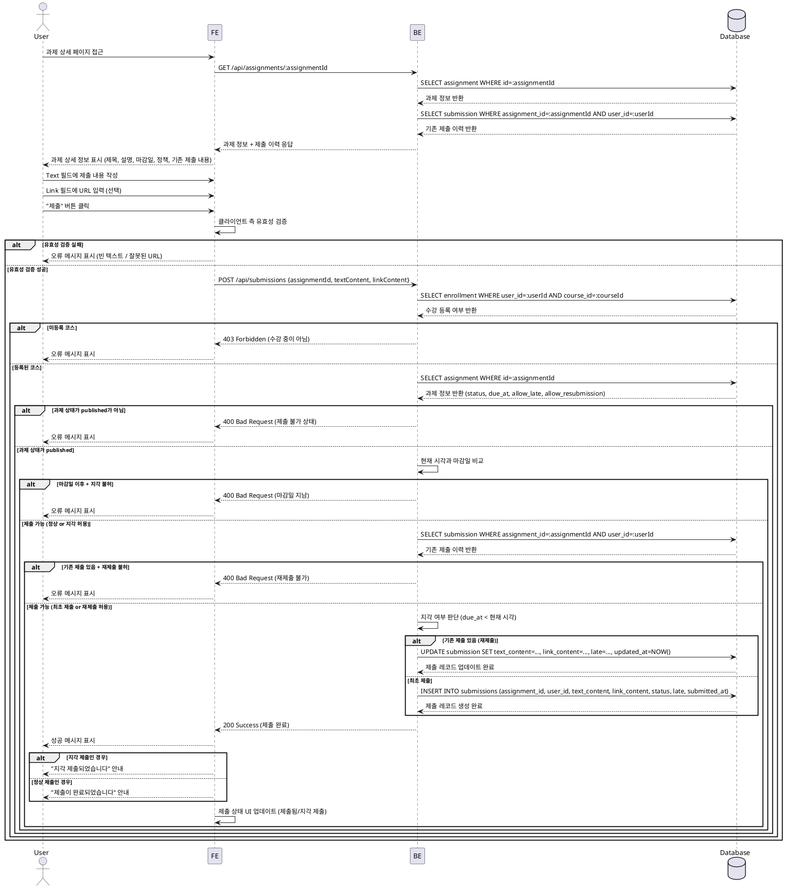

# UC-004: 과제 제출 (Learner)

## Primary Actor
Learner (학습자)

## Precondition
- 사용자가 Learner 역할로 로그인되어 있음
- 사용자가 해당 코스에 수강신청이 완료되어 있음
- 과제 상태가 `published`임
- 과제 상세 페이지에 접근 가능

## Trigger
사용자가 수강 중인 코스의 과제 상세 페이지에서 과제 제출 폼을 작성하고 "제출" 버튼을 클릭함

## Main Scenario

1. 사용자가 수강 중인 코스의 과제 목록에서 특정 과제를 선택
2. 시스템이 과제 상세 정보를 표시 (제목, 설명, 마감일, 점수 비중, 정책)
3. 사용자가 Text 필드(필수)에 제출 내용을 작성
4. 사용자가 Link 필드(선택)에 URL을 입력 (선택 사항)
5. 사용자가 "제출" 버튼을 클릭
6. 시스템이 클라이언트 측에서 입력값 유효성 검증
   - Text 필드: 빈 값이 아닌지 확인
   - Link 필드: 입력된 경우 유효한 URL 형식인지 확인
7. 시스템이 서버 측에서 제출 가능 여부 검증
   - 코스 등록 여부 확인
   - 과제 상태가 `published`인지 확인
   - 마감일 확인 (정상 제출 vs 지각 제출 vs 차단)
   - 재제출 정책 확인 (기존 제출 이력 확인)
8. 검증 통과 시, `submissions` 테이블에 제출 레코드 생성 또는 업데이트
9. 시스템이 제출 상태를 업데이트 (`submitted`, `late` 플래그)
10. 시스템이 성공 메시지를 표시하고 제출 상태를 화면에 반영

## Edge Cases

### EC1: 텍스트 필드 미입력
- **상황**: 필수 Text 필드가 비어있거나 공백만 입력된 경우
- **처리**: 클라이언트 측에서 "제출 내용을 입력해주세요" 오류 메시지 표시

### EC2: 잘못된 URL 형식
- **상황**: Link 필드에 유효하지 않은 URL 형식이 입력된 경우
- **처리**: "올바른 URL 형식을 입력해주세요" 오류 메시지 표시

### EC3: 마감일 이후 제출 (지각 허용)
- **상황**: 마감일이 지났지만 과제 정책에서 지각 제출을 허용하는 경우
- **처리**: 제출 허용, `status=submitted`, `late=true` 플래그 설정, "지각 제출되었습니다" 안내 메시지 표시

### EC4: 마감일 이후 제출 (지각 불허)
- **상황**: 마감일이 지났고 과제 정책에서 지각 제출을 허용하지 않는 경우
- **처리**: 제출 차단, "마감일이 지나 제출할 수 없습니다" 오류 메시지 표시

### EC5: 재제출 시도 (재제출 허용)
- **상황**: 이미 제출한 과제에 대해 재제출을 시도하며, 과제 정책에서 재제출을 허용하는 경우
- **처리**: 기존 제출 내용을 덮어쓰기 또는 새 버전 생성, "재제출이 완료되었습니다" 안내 메시지 표시

### EC6: 재제출 시도 (재제출 불허)
- **상황**: 이미 제출한 과제에 대해 재제출을 시도하며, 과제 정책에서 재제출을 허용하지 않는 경우
- **처리**: 제출 차단, "이미 제출한 과제입니다. 재제출이 허용되지 않습니다" 오류 메시지 표시

### EC7: 미등록 코스의 과제 제출 시도
- **상황**: 사용자가 수강신청하지 않은 코스의 과제에 접근하여 제출 시도
- **처리**: 403 Forbidden 에러, "수강 중인 코스가 아닙니다" 오류 메시지 표시

### EC8: 과제 상태가 `closed`인 경우
- **상황**: 과제 상태가 `closed`로 변경된 후 제출 시도
- **처리**: 제출 차단, "마감된 과제입니다" 오류 메시지 표시

### EC9: 네트워크 오류
- **상황**: 제출 요청 중 네트워크 오류 발생
- **처리**: "네트워크 오류가 발생했습니다. 다시 시도해주세요" 오류 메시지 표시, 폼 상태 유지

### EC10: 동시 제출 시도 (Race Condition)
- **상황**: 동일 사용자가 동일 과제에 거의 동시에 여러 번 제출 시도
- **처리**: 서버 측에서 트랜잭션 처리로 중복 방지, 첫 번째 요청만 처리

## Business Rules

### BR-001: 제출 필수 필드
- Text 필드는 필수 입력 항목
- Link 필드는 선택 사항이지만, 입력 시 유효한 URL 형식이어야 함

### BR-002: 마감일 기준 제출 정책
- 마감일 전: 정상 제출 (`status=submitted`, `late=false`)
- 마감일 후 + 지각 허용: 지각 제출 (`status=submitted`, `late=true`)
- 마감일 후 + 지각 불허: 제출 차단

### BR-003: 재제출 정책
- 재제출 허용: 기존 제출 레코드를 업데이트 (`updated_at` 갱신)
- 재제출 불허: 최초 제출 이후 추가 제출 차단

### BR-004: 과제 상태별 제출 가능 여부
- `draft`: 제출 불가 (Learner에게 비공개)
- `published`: 제출 가능
- `closed`: 제출 불가

### BR-005: 제출 권한
- 해당 코스에 등록된 Learner만 과제 제출 가능
- Instructor는 자신의 코스라도 Learner로 제출할 수 없음

### BR-006: 제출 데이터 저장
- `submissions` 테이블에 다음 정보 저장:
  - `assignment_id`: 과제 ID
  - `user_id`: 제출자 ID
  - `text_content`: 텍스트 제출 내용
  - `link_content`: URL (선택)
  - `status`: 제출 상태 (`submitted`)
  - `late`: 지각 여부 (boolean)
  - `submitted_at`: 제출 시각
  - `updated_at`: 최종 수정 시각

### BR-007: URL 형식 검증
- Link 필드는 `http://` 또는 `https://`로 시작하는 유효한 URL이어야 함
- 빈 값은 허용 (선택 필드)

---

## Sequence Diagram

