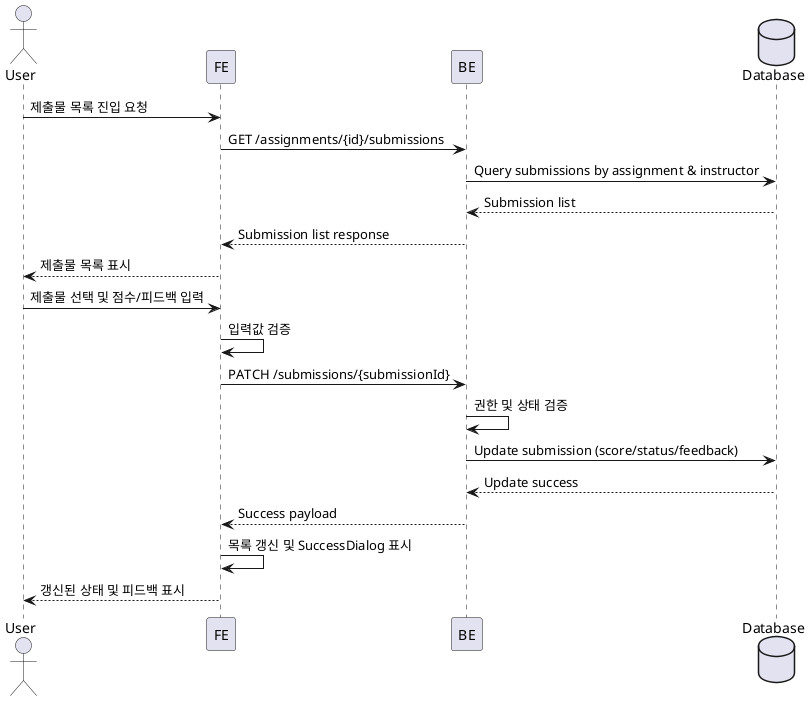

# Assignment Grading & Feedback Use Case

## Primary Actor
- Instructor (과제 채점 및 피드백 담당자)

## Precondition (사용자 관점)
- Instructor는 본인 계정으로 로그인해 있으며, 해당 코스의 소유자다.
- 채점 대상 과제가 `published` 상태이고, 학습자의 제출물이 존재한다.

## Trigger
- Instructor가 대시보드에서 특정 과제의 제출물 목록을 열람하고 채점 또는 피드백 입력을 선택한다.

## Main Scenario
1. Instructor가 대시보드에서 과제 제출물 목록을 연다.
2. 시스템이 Supabase에서 제출물 리스트를 조회하고 화면에 출력한다.
3. Instructor가 특정 제출물을 선택하고 점수(0~100)와 피드백을 입력한다.
4. Instructor가 `점수 저장` 또는 `재제출 요청`을 선택한다.
5. 프런트엔드가 입력값을 검증한 뒤 백엔드 API를 호출한다.
6. 백엔드는 Instructor 권한과 코스 소유권을 검증하고 제출물 상태를 변경한다.
7. 데이터베이스가 제출물 레코드를 업데이트하고 타임스탬프를 기록한다.
8. 백엔드는 성공 응답과 함께 갱신된 제출물 데이터를 반환한다.
9. 프런트엔드는 성공 다이얼로그를 표시하고 목록을 최신 상태로 반영한다.
10. Learner는 갱신된 상태와 피드백을 확인할 수 있다.

## Edge Cases
- 권한 오류: Instructor가 본인 코스가 아닌 제출물에 접근하면 실패 다이얼로그로 안내하고 접근을 차단한다.
- 유효성 오류: 점수 범위(0~100) 벗어나거나 피드백 미입력 시 로컬 검증 후 에러 다이얼로그를 보여준다.
- 상태 충돌: 제출물이 이미 `graded` 상태에서 다시 재제출 요청 시 최신 버전 여부를 확인하고, 충돌 시 실패 다이얼로그를 반환한다.
- 네트워크/서버 오류: API 호출 실패 시 재시도 안내를 포함한 에러 다이얼로그를 표시한다.

## Business Rules
- 점수는 0 이상 100 이하의 정수여야 한다.
- 피드백 텍스트는 필수이며 공백만 입력할 수 없다.
- 재제출 요청 시 제출물 상태는 `resubmission_required`로 변경되고, Learner에게 재제출 권한이 부여된다.
- 점수 입력 완료 시 제출물 상태는 `graded`로 변경되고 수정 시 갱신 이력이 기록된다.
- Instructor는 본인 소유 코스의 제출물만 채점하거나 재제출 요청할 수 있다.

## Sequence Diagram

