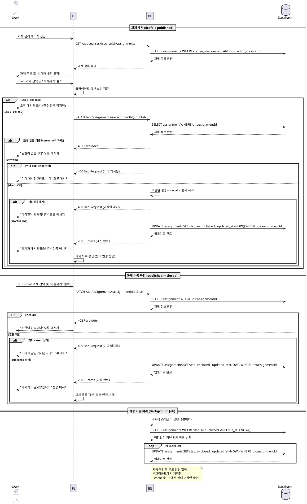

# UC-006: Assignment 게시/마감 (Instructor)

## Primary Actor
Instructor (강사)

## Precondition
- 사용자가 Instructor 역할로 로그인되어 있음
- 사용자가 소유한 코스가 존재함
- 해당 코스에 과제가 생성되어 있음 (draft 또는 published 상태)

## Trigger
- Instructor가 과제 관리 화면에서 "게시하기" 버튼을 클릭함
- Instructor가 "마감하기" 버튼을 수동으로 클릭함
- 과제의 마감일이 도래하여 자동 마감이 트리거됨

## Main Scenario

### 과제 게시 플로우 (draft → published)

1. Instructor가 본인 코스의 과제 관리 페이지에 접근
2. 시스템이 과제 목록을 표시 (각 과제의 상태 배지 포함)
3. Instructor가 `draft` 상태의 과제를 선택
4. Instructor가 "게시하기" 버튼을 클릭
5. 시스템이 과제 정보 유효성 검증 (제목, 설명, 마감일 필수 항목 확인)
6. 시스템이 Instructor 권한 및 코스 소유권 검증
7. 시스템이 과제 상태를 `draft`에서 `published`로 변경
8. 시스템이 변경 사항을 데이터베이스에 저장
9. 시스템이 성공 메시지를 표시
10. 시스템이 과제 목록을 갱신하여 상태 변경을 반영
11. Learner에게 해당 과제가 노출됨

### 과제 마감 플로우 (published → closed)

#### 수동 마감
1. Instructor가 `published` 상태의 과제를 선택
2. Instructor가 "마감하기" 버튼을 클릭
3. 시스템이 권한 검증 및 현재 상태 확인
4. 시스템이 과제 상태를 `published`에서 `closed`로 변경
5. 시스템이 변경 사항을 데이터베이스에 저장
6. 시스템이 성공 메시지를 표시
7. Learner 화면에서 해당 과제의 제출 버튼이 비활성화됨

#### 자동 마감
1. 시스템이 주기적으로 마감일이 도래한 과제를 조회
2. 시스템이 `published` 상태이면서 마감일이 현재 시각보다 이전인 과제를 식별
3. 시스템이 해당 과제의 상태를 자동으로 `closed`로 변경
4. 시스템이 변경 사항을 데이터베이스에 저장
5. Learner 화면에서 자동으로 제출 불가 상태로 전환됨

## Edge Cases

### EC1: 이미 게시된 과제를 다시 게시하려는 경우
- **상황**: 과제 상태가 이미 `published`인 경우 "게시하기" 버튼을 다시 클릭
- **처리**: "이미 게시된 과제입니다" 에러 메시지 표시, 작업 차단

### EC2: 마감일이 과거인 과제를 게시하려는 경우
- **상황**: `draft` 상태의 과제 마감일이 현재 시각보다 이전인 경우 게시 시도
- **처리**: "마감일이 과거입니다. 마감일을 수정한 후 게시해주세요" 경고 메시지 표시, 게시 차단

### EC3: 과제 필수 항목 미입력 상태에서 게시 시도
- **상황**: 제목, 설명, 마감일 등 필수 항목이 누락된 상태에서 게시 시도
- **처리**: "필수 항목을 모두 입력해주세요" 에러 메시지 표시, 누락된 항목 강조

### EC4: 제출물이 있는 상태에서 과제 삭제 시도
- **상황**: Learner 제출물이 존재하는 과제를 삭제하려는 경우
- **처리**: "제출물이 있는 과제는 삭제할 수 없습니다" 경고 메시지 표시, 삭제 차단

### EC5: 다른 Instructor의 과제에 대한 게시/마감 시도
- **상황**: 본인이 소유하지 않은 코스의 과제를 게시/마감하려는 경우
- **처리**: 403 Forbidden 에러, "권한이 없습니다" 오류 메시지 표시

### EC6: 네트워크 오류
- **상황**: 게시/마감 요청 중 네트워크 오류 발생
- **처리**: "네트워크 오류가 발생했습니다. 다시 시도해주세요" 오류 메시지 표시

### EC7: 이미 마감된 과제를 다시 마감하려는 경우
- **상황**: 과제 상태가 이미 `closed`인 경우 "마감하기" 버튼을 다시 클릭
- **처리**: "이미 마감된 과제입니다" 에러 메시지 표시, 작업 차단

### EC8: 동시 상태 변경 시도 (Race Condition)
- **상황**: 동일한 과제에 대해 여러 번의 상태 변경 요청이 거의 동시에 발생
- **처리**: 서버 측에서 트랜잭션 처리로 중복 방지, 최신 상태 기준으로 검증

## Business Rules

### BR-001: 상태 전환 규칙
- `draft → published`: 과제가 Learner에게 노출되고 제출 가능해짐
- `published → closed`: 제출 불가, 채점만 가능
- 역방향 전환 불가 (published → draft, closed → published)

### BR-002: 게시 조건
- 제목, 설명, 마감일, 점수 비중은 필수 입력 항목
- 마감일은 현재 시각 이후여야 함
- 과제 상태가 `draft`일 때만 게시 가능

### BR-003: 마감 조건
- 과제 상태가 `published`일 때만 수동 마감 가능
- 마감일이 현재 시각보다 이전이면 자동으로 `closed` 상태로 전환
- `closed` 상태에서는 더 이상 Learner가 제출할 수 없음

### BR-004: 권한 검증
- Instructor만 과제를 게시/마감할 수 있음
- 본인이 소유한 코스의 과제만 게시/마감 가능
- Learner는 과제 상태를 변경할 수 없음

### BR-005: 과제 삭제 제한
- `closed` 상태이거나 제출물이 있는 과제는 삭제 불가
- `draft` 상태이고 제출물이 없는 과제만 삭제 가능

### BR-006: Learner 노출 규칙
- `draft` 상태: Learner에게 비공개
- `published` 상태: Learner 과제 목록에 노출, 제출 가능
- `closed` 상태: Learner 과제 목록에 노출, 제출 불가, 채점 결과만 확인 가능

### BR-007: 자동 마감 처리
- 시스템은 주기적으로 (예: 5분마다) 마감일이 지난 `published` 과제를 조회
- 조건을 만족하는 과제는 자동으로 `closed` 상태로 전환
- 자동 마감 시 별도의 알림은 표시하지 않음 (UI에서 상태 변경만 반영)

### BR-008: 과제 수정 제한
- `draft` 상태: 모든 필드 수정 가능
- `published` 상태: 제목, 설명만 수정 가능 (마감일, 점수 비중, 정책 수정 불가)
- `closed` 상태: 수정 불가 (채점만 가능)

---

## Sequence Diagram

