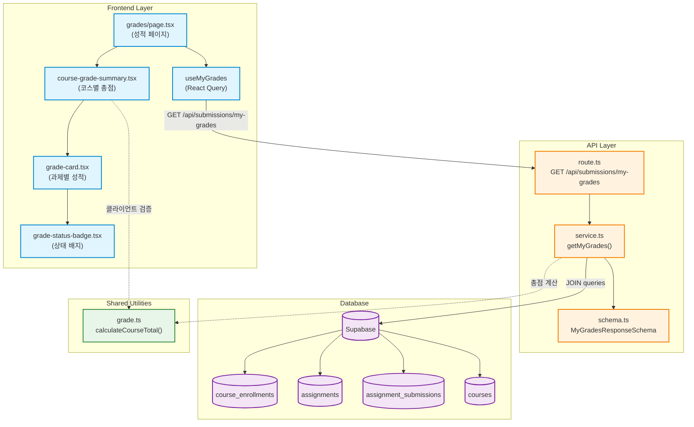

# 성적 & 피드백 열람 (Learner) - Implementation Plan

## 개요

학습자가 자신이 수강 중인 코스의 성적과 피드백을 조회하는 기능을 구현합니다.

### 주요 모듈

| 모듈 | 위치 | 설명 |
|------|------|------|
| **Backend API** | `src/features/submissions/backend/` | 성적 조회 엔드포인트 추가 |
| **Service Layer** | `src/features/submissions/backend/service.ts` | 성적 집계 비즈니스 로직 |
| **Schema** | `src/features/submissions/backend/schema.ts` | 성적 응답 DTO 스키마 정의 |
| **Frontend Hooks** | `src/features/submissions/hooks/` | React Query 훅 |
| **Components** | `src/features/submissions/components/grades/` | 성적 표시 컴포넌트 |
| **Page** | `src/app/(protected)/grades/page.tsx` | 성적 조회 페이지 |
| **Utilities** | `src/lib/utils/grade.ts` | 성적 계산 유틸리티 |

---

## Diagram



---

## Implementation Plan

### 1. Backend Layer

#### 1.1. Schema Definition (`src/features/submissions/backend/schema.ts`)

**Task**: 성적 조회 응답 스키마 추가

```typescript
// 과제별 성적 정보
export const AssignmentGradeItemSchema = z.object({
  assignmentId: z.string().uuid(),
  assignmentTitle: z.string(),
  assignmentStatus: z.enum(['draft', 'published', 'closed']),
  dueAt: z.string(),
  scoreWeight: z.number(), // 0-100 범위 (예: 30 = 30%)
  
  // 제출물 정보 (없을 경우 모두 null)
  submissionId: z.string().uuid().nullable(),
  submittedAt: z.string().nullable(),
  status: z.enum(['submitted', 'graded', 'resubmission_required']).nullable(),
  late: z.boolean().nullable(),
  score: z.number().nullable(), // 0-100 범위
  feedback: z.string().nullable(),
  gradedAt: z.string().nullable(),
});

// 코스별 성적 요약
export const CourseGradeSummarySchema = z.object({
  courseId: z.string().uuid(),
  courseTitle: z.string(),
  instructorName: z.string(),
  totalAssignments: z.number().int(),
  gradedAssignments: z.number().int(),
  totalScore: z.number().nullable(), // 채점 완료된 과제의 가중 총점
  maxPossibleScore: z.number(), // 100 (모든 과제가 만점일 경우)
  assignments: z.array(AssignmentGradeItemSchema),
});

// 전체 성적 응답
export const MyGradesResponseSchema = z.object({
  courses: z.array(CourseGradeSummarySchema),
});

export type AssignmentGradeItem = z.infer<typeof AssignmentGradeItemSchema>;
export type CourseGradeSummary = z.infer<typeof CourseGradeSummarySchema>;
export type MyGradesResponse = z.infer<typeof MyGradesResponseSchema>;
```

**Unit Test (schema.test.ts)**:
- ✅ 정상 데이터 파싱 성공
- ✅ 제출하지 않은 과제 (submission 필드 모두 null)
- ✅ 채점되지 않은 제출물 (score, feedback null)
- ✅ 재제출 요청 상태 파싱
- ❌ 잘못된 UUID 형식
- ❌ scoreWeight가 음수 또는 100 초과
- ❌ 잘못된 status enum 값

---

#### 1.2. Service Layer (`src/features/submissions/backend/service.ts`)

**Task**: `getMyGrades` 함수 구현

```typescript
export const getMyGrades = async (
  supabase: SupabaseClient<Database>,
  userId: string
): Promise<ServiceResult<MyGradesResponse>> => {
  try {
    // 1. 수강 중인 코스 조회
    const { data: enrollments, error: enrollError } = await supabase
      .from('course_enrollments')
      .select(`
        course_id,
        courses (
          id,
          title,
          instructor:profiles!courses_instructor_id_fkey(full_name)
        )
      `)
      .eq('learner_id', userId);

    if (enrollError) {
      return failure(500, submissionErrorCodes.fetchError, enrollError.message);
    }

    if (!enrollments || enrollments.length === 0) {
      return success({ courses: [] });
    }

    // 2. 각 코스별로 과제 및 제출물 조회
    const courseSummaries: CourseGradeSummary[] = [];

    for (const enrollment of enrollments) {
      const course = Array.isArray(enrollment.courses) 
        ? enrollment.courses[0] 
        : enrollment.courses;
      
      if (!course) continue;

      // 과제 조회 (draft 제외)
      const { data: assignments, error: assignError } = await supabase
        .from('assignments')
        .select('*')
        .eq('course_id', course.id)
        .neq('status', 'draft')
        .order('due_at', { ascending: true });

      if (assignError) {
        return failure(500, submissionErrorCodes.fetchError, assignError.message);
      }

      const assignmentGrades: AssignmentGradeItem[] = [];
      let totalScore = 0;
      let gradedCount = 0;

      // 3. 각 과제별 제출물 조회
      for (const assignment of assignments || []) {
        const { data: submission } = await (supabase
          .from('assignment_submissions') as any)
          .select('*')
          .eq('assignment_id', assignment.id)
          .eq('learner_id', userId)
          .eq('is_latest', true)
          .single();

        const gradeItem: AssignmentGradeItem = {
          assignmentId: assignment.id,
          assignmentTitle: assignment.title,
          assignmentStatus: assignment.status,
          dueAt: assignment.due_at,
          scoreWeight: assignment.score_weight,
          submissionId: submission?.id || null,
          submittedAt: submission?.submitted_at || null,
          status: submission?.status || null,
          late: submission?.late || null,
          score: submission?.score || null,
          feedback: submission?.feedback || null,
          gradedAt: submission?.graded_at || null,
        };

        assignmentGrades.push(gradeItem);

        // 총점 계산: 채점 완료된 과제만
        if (submission?.status === 'graded' && submission?.score !== null) {
          totalScore += (submission.score * assignment.score_weight) / 100;
          gradedCount++;
        }
      }

      const instructor = Array.isArray(course.instructor)
        ? course.instructor[0]
        : course.instructor;

      courseSummaries.push({
        courseId: course.id,
        courseTitle: course.title,
        instructorName: instructor?.full_name || '알 수 없음',
        totalAssignments: assignments?.length || 0,
        gradedAssignments: gradedCount,
        totalScore: gradedCount > 0 ? totalScore : null,
        maxPossibleScore: 100,
        assignments: assignmentGrades,
      });
    }

    return success({ courses: courseSummaries });
  } catch (err) {
    return failure(
      500,
      submissionErrorCodes.fetchError,
      err instanceof Error ? err.message : '알 수 없는 오류가 발생했습니다.'
    );
  }
};
```

**Unit Test (service.test.ts)**:
- ✅ 정상 케이스: 수강 중인 코스, 제출한 과제, 채점 완료된 과제
- ✅ 수강 중인 코스가 없는 경우: 빈 배열 반환
- ✅ 과제가 없는 코스: totalAssignments = 0
- ✅ 제출하지 않은 과제: submission 필드 모두 null
- ✅ 채점되지 않은 제출물: score null, totalScore 계산 제외
- ✅ 재제출 요청 상태: status = 'resubmission_required'
- ✅ 지각 제출: late = true
- ✅ 총점 계산: (score1 * weight1 / 100) + (score2 * weight2 / 100)
- ❌ 권한 없는 사용자 (다른 학습자 ID로 요청)

---

#### 1.3. Route Definition (`src/features/submissions/backend/route.ts`)

**Task**: `GET /api/submissions/my-grades` 엔드포인트 추가

```typescript
export const registerSubmissionsRoutes = (app: Hono<AppEnv>) => {
  // ... 기존 라우트들 ...

  app.get('/submissions/my-grades', async (c) => {
    const supabase = c.get('supabase');
    
    const { data: { user }, error: authError } = await supabase.auth.getUser();
    
    if (authError || !user) {
      return c.json(
        { success: false, error: 'UNAUTHORIZED', message: '인증이 필요합니다.' },
        401
      );
    }

    const result = await getMyGrades(supabase, user.id);

    return respond(c, result);
  });
};
```

**Unit Test (route.test.ts)**:
- ✅ 인증된 사용자: 200 응답
- ❌ 인증되지 않은 사용자: 401 응답
- ✅ 응답 형식: MyGradesResponseSchema 검증

---

### 2. Frontend Layer

#### 2.1. DTO Re-export (`src/features/submissions/lib/dto.ts`)

**Task**: 백엔드 스키마를 프론트엔드에서 재사용

```typescript
// 기존 export들...

export { 
  MyGradesResponseSchema,
  AssignmentGradeItemSchema,
  CourseGradeSummarySchema,
} from '../backend/schema';

export type {
  MyGradesResponse,
  AssignmentGradeItem,
  CourseGradeSummary,
} from '../backend/schema';
```

---

#### 2.2. React Query Hook (`src/features/submissions/hooks/useMyGrades.ts`)

**Task**: 성적 조회 훅

```typescript
import { useQuery } from '@tanstack/react-query';
import { apiClient } from '@/lib/remote/api-client';
import type { MyGradesResponse } from '../lib/dto';

export const useMyGrades = () => {
  return useQuery({
    queryKey: ['submissions', 'my-grades'],
    queryFn: async () => {
      const response = await apiClient.get<MyGradesResponse>(
        '/submissions/my-grades'
      );
      return response.data;
    },
    staleTime: 1000 * 60 * 5, // 5분 (실시간성 유지)
    retry: 1,
  });
};
```

**QA Sheet**:
| 항목 | 테스트 시나리오 | 예상 결과 |
|------|-----------------|-----------|
| 로딩 상태 | 페이지 진입 시 | 로딩 스피너 표시 |
| 정상 조회 | 수강 중인 코스가 있는 경우 | 코스별 성적 카드 표시 |
| 빈 상태 | 수강 중인 코스가 없는 경우 | "아직 수강 중인 코스가 없습니다" 표시 |
| 에러 처리 | API 오류 발생 시 | ErrorDialog 표시 |
| 인증 실패 | 토큰 만료 시 | 로그인 페이지로 리다이렉트 |

---

#### 2.3. Components

##### 2.3.1. Grade Status Badge (`src/features/submissions/components/grades/grade-status-badge.tsx`)

**Task**: 과제 상태 배지 컴포넌트

```typescript
'use client';

import { Badge } from '@/components/ui/badge';
import { CheckCircle2, Clock, AlertCircle, XCircle } from 'lucide-react';
import type { AssignmentGradeItem } from '@/features/submissions/lib/dto';

interface GradeStatusBadgeProps {
  grade: AssignmentGradeItem;
}

export function GradeStatusBadge({ grade }: GradeStatusBadgeProps) {
  // 미제출
  if (!grade.submissionId) {
    return (
      <Badge variant="outline" className="gap-1">
        <XCircle className="h-3 w-3" />
        미제출
      </Badge>
    );
  }

  // 상태별 배지
  if (grade.status === 'graded') {
    return (
      <div className="flex gap-2">
        <Badge variant="default" className="gap-1 bg-green-600">
          <CheckCircle2 className="h-3 w-3" />
          채점 완료
        </Badge>
        {grade.late && (
          <Badge variant="destructive" className="gap-1">
            지각 제출
          </Badge>
        )}
      </div>
    );
  }

  if (grade.status === 'resubmission_required') {
    return (
      <Badge variant="destructive" className="gap-1">
        <AlertCircle className="h-3 w-3" />
        재제출 요청
      </Badge>
    );
  }

  // 제출됨 (채점 대기)
  return (
    <Badge variant="secondary" className="gap-1">
      <Clock className="h-3 w-3" />
      채점 대기
    </Badge>
  );
}
```

**QA Sheet**:
| 상태 | 표시 내용 | 스타일 |
|------|-----------|--------|
| 미제출 | "미제출" + XCircle | outline |
| 채점 완료 | "채점 완료" + CheckCircle2 | green-600 |
| 채점 완료 + 지각 | "채점 완료" + "지각 제출" | green-600 + destructive |
| 재제출 요청 | "재제출 요청" + AlertCircle | destructive |
| 제출됨 (채점 대기) | "채점 대기" + Clock | secondary |

---

##### 2.3.2. Grade Card (`src/features/submissions/components/grades/grade-card.tsx`)

**Task**: 과제별 성적 카드

```typescript
'use client';

import { Card, CardContent, CardDescription, CardHeader, CardTitle } from '@/components/ui/card';
import { Badge } from '@/components/ui/badge';
import { format } from 'date-fns';
import { ko } from 'date-fns/locale';
import { GradeStatusBadge } from './grade-status-badge';
import type { AssignmentGradeItem } from '@/features/submissions/lib/dto';
import { Calendar, Target } from 'lucide-react';

interface GradeCardProps {
  grade: AssignmentGradeItem;
}

export function GradeCard({ grade }: GradeCardProps) {
  const dueDate = new Date(grade.dueAt);
  const hasScore = grade.score !== null && grade.status === 'graded';

  return (
    <Card>
      <CardHeader>
        <div className="flex items-start justify-between">
          <div className="space-y-1">
            <CardTitle className="text-lg">{grade.assignmentTitle}</CardTitle>
            <CardDescription className="flex items-center gap-4">
              <span className="flex items-center gap-1">
                <Calendar className="h-3 w-3" />
                마감: {format(dueDate, 'PPP', { locale: ko })}
              </span>
              <span className="flex items-center gap-1">
                <Target className="h-3 w-3" />
                비중: {grade.scoreWeight}%
              </span>
            </CardDescription>
          </div>
          <GradeStatusBadge grade={grade} />
        </div>
      </CardHeader>
      <CardContent className="space-y-4">
        {/* 점수 표시 */}
        {hasScore ? (
          <div className="rounded-lg border p-4 bg-muted/30">
            <div className="text-center">
              <p className="text-sm text-muted-foreground mb-1">획득 점수</p>
              <p className="text-4xl font-bold text-primary">{grade.score}점</p>
              <p className="text-xs text-muted-foreground mt-1">
                가중 점수: {((grade.score * grade.scoreWeight) / 100).toFixed(1)}점
              </p>
            </div>
          </div>
        ) : grade.submissionId ? (
          <div className="rounded-lg border p-4 bg-muted/30">
            <p className="text-center text-muted-foreground">채점 대기 중</p>
          </div>
        ) : (
          <div className="rounded-lg border p-4 bg-muted/30">
            <p className="text-center text-muted-foreground">미제출</p>
          </div>
        )}

        {/* 피드백 표시 */}
        {grade.feedback && (
          <div className="rounded-lg border p-4">
            <p className="text-sm font-medium mb-2">강사 피드백</p>
            <p className="text-sm text-muted-foreground whitespace-pre-wrap">
              {grade.feedback}
            </p>
            {grade.gradedAt && (
              <p className="text-xs text-muted-foreground mt-2">
                채점일: {format(new Date(grade.gradedAt), 'PPP p', { locale: ko })}
              </p>
            )}
          </div>
        )}

        {/* 재제출 안내 */}
        {grade.status === 'resubmission_required' && (
          <div className="rounded-lg border border-destructive/50 p-4 bg-destructive/5">
            <p className="text-sm font-medium text-destructive mb-1">재제출이 필요합니다</p>
            <p className="text-xs text-muted-foreground">
              강사의 피드백을 확인하고 과제를 다시 제출해주세요.
            </p>
          </div>
        )}
      </CardContent>
    </Card>
  );
}
```

**QA Sheet**:
| 시나리오 | 표시 내용 | 검증 항목 |
|----------|-----------|-----------|
| 채점 완료 | 점수, 가중 점수, 피드백 | 점수 계산 정확성, 날짜 형식 |
| 채점 대기 | "채점 대기 중" | 점수 영역 표시 안 됨 |
| 미제출 | "미제출" | 회색 배경 |
| 재제출 요청 | 재제출 안내 메시지 | 붉은색 테두리 |
| 피드백 없음 | 피드백 영역 미표시 | - |
| 지각 제출 | "지각 제출" 배지 | 상단 우측 표시 |

---

##### 2.3.3. Course Grade Summary (`src/features/submissions/components/grades/course-grade-summary.tsx`)

**Task**: 코스별 성적 요약 컴포넌트

```typescript
'use client';

import { Card, CardContent, CardDescription, CardHeader, CardTitle } from '@/components/ui/card';
import { Progress } from '@/components/ui/progress';
import { GradeCard } from './grade-card';
import type { CourseGradeSummary } from '@/features/submissions/lib/dto';
import { BookOpen, User, TrendingUp } from 'lucide-react';

interface CourseGradeSummaryProps {
  course: CourseGradeSummary;
}

export function CourseGradeSummaryCard({ course }: CourseGradeSummaryProps) {
  const completionRate = course.totalAssignments > 0
    ? (course.gradedAssignments / course.totalAssignments) * 100
    : 0;

  const displayScore = course.totalScore !== null 
    ? course.totalScore.toFixed(1) 
    : 'N/A';

  return (
    <div className="space-y-6">
      {/* 코스 요약 카드 */}
      <Card className="border-2">
        <CardHeader>
          <div className="flex items-start justify-between">
            <div>
              <CardTitle className="text-2xl flex items-center gap-2">
                <BookOpen className="h-6 w-6" />
                {course.courseTitle}
              </CardTitle>
              <CardDescription className="flex items-center gap-1 mt-1">
                <User className="h-3 w-3" />
                강사: {course.instructorName}
              </CardDescription>
            </div>
            <div className="text-right">
              <div className="text-3xl font-bold text-primary">
                {displayScore}
                <span className="text-base text-muted-foreground ml-1">/ 100</span>
              </div>
              <p className="text-xs text-muted-foreground mt-1">
                총점
              </p>
            </div>
          </div>
        </CardHeader>
        <CardContent className="space-y-4">
          {/* 진행률 */}
          <div className="space-y-2">
            <div className="flex items-center justify-between text-sm">
              <span className="text-muted-foreground">채점 진행률</span>
              <span className="font-medium">
                {course.gradedAssignments} / {course.totalAssignments} 과제
              </span>
            </div>
            <Progress value={completionRate} className="h-2" />
          </div>

          {/* 통계 */}
          <div className="grid grid-cols-3 gap-4 pt-2">
            <div className="text-center">
              <p className="text-2xl font-bold">{course.totalAssignments}</p>
              <p className="text-xs text-muted-foreground">전체 과제</p>
            </div>
            <div className="text-center">
              <p className="text-2xl font-bold text-green-600">{course.gradedAssignments}</p>
              <p className="text-xs text-muted-foreground">채점 완료</p>
            </div>
            <div className="text-center">
              <p className="text-2xl font-bold text-orange-600">
                {course.totalAssignments - course.gradedAssignments}
              </p>
              <p className="text-xs text-muted-foreground">미채점</p>
            </div>
          </div>
        </CardContent>
      </Card>

      {/* 과제별 성적 목록 */}
      {course.assignments.length > 0 ? (
        <div className="space-y-4">
          <h3 className="text-lg font-semibold">과제별 성적</h3>
          <div className="grid gap-4">
            {course.assignments.map((grade) => (
              <GradeCard key={grade.assignmentId} grade={grade} />
            ))}
          </div>
        </div>
      ) : (
        <Card>
          <CardContent className="py-8 text-center text-muted-foreground">
            아직 과제가 없습니다.
          </CardContent>
        </Card>
      )}
    </div>
  );
}
```

**QA Sheet**:
| 시나리오 | 표시 내용 | 검증 항목 |
|----------|-----------|-----------|
| 정상 케이스 | 코스명, 강사명, 총점, 진행률, 과제 목록 | 총점 소수점 1자리, 진행률 계산 |
| 채점 완료 0개 | "N/A" | totalScore null 처리 |
| 과제 없음 | "아직 과제가 없습니다" | 빈 상태 메시지 |
| 진행률 0% | Progress bar 0% | 시각적 표시 |
| 진행률 100% | Progress bar 100% | 모든 과제 채점 완료 |

---

#### 2.4. Page (`src/app/(protected)/grades/page.tsx`)

**Task**: 성적 조회 페이지

```typescript
'use client';

import { useMyGrades } from '@/features/submissions/hooks/useMyGrades';
import { CourseGradeSummaryCard } from '@/features/submissions/components/grades/course-grade-summary';
import { ErrorDialog } from '@/components/ui/error-dialog';
import { extractApiErrorMessage } from '@/lib/remote/api-client';
import { Loader2, GraduationCap } from 'lucide-react';
import { useState } from 'react';

export default function GradesPage() {
  const { data, isLoading, error, refetch } = useMyGrades();
  const [errorOpen, setErrorOpen] = useState(false);

  if (isLoading) {
    return (
      <div className="flex items-center justify-center min-h-[400px]">
        <Loader2 className="h-8 w-8 animate-spin text-muted-foreground" />
      </div>
    );
  }

  if (error) {
    return (
      <>
        <ErrorDialog
          open={true}
          onOpenChange={(open) => {
            if (!open) window.location.href = '/dashboard';
          }}
          title="성적 조회 실패"
          description={extractApiErrorMessage(error, '성적을 불러올 수 없습니다.')}
        />
      </>
    );
  }

  const courses = data?.courses || [];

  return (
    <div className="container max-w-6xl py-8 space-y-8">
      {/* 헤더 */}
      <div className="space-y-2">
        <h1 className="text-3xl font-bold flex items-center gap-2">
          <GraduationCap className="h-8 w-8" />
          내 성적
        </h1>
        <p className="text-muted-foreground">
          수강 중인 코스의 과제 성적과 피드백을 확인하세요.
        </p>
      </div>

      {/* 성적 목록 */}
      {courses.length === 0 ? (
        <div className="flex flex-col items-center justify-center min-h-[400px] space-y-4">
          <GraduationCap className="h-16 w-16 text-muted-foreground" />
          <p className="text-xl font-medium text-muted-foreground">
            아직 수강 중인 코스가 없습니다
          </p>
          <p className="text-sm text-muted-foreground">
            코스를 수강신청하고 과제를 제출해보세요.
          </p>
        </div>
      ) : (
        <div className="space-y-8">
          {courses.map((course) => (
            <CourseGradeSummaryCard key={course.courseId} course={course} />
          ))}
        </div>
      )}
    </div>
  );
}
```

**QA Sheet**:
| 시나리오 | 사용자 액션 | 예상 결과 | 검증 항목 |
|----------|-------------|-----------|-----------|
| 페이지 진입 | `/grades` 접근 | 로딩 스피너 → 성적 목록 | 데이터 로딩 |
| 수강 중인 코스 있음 | 조회 성공 | 코스별 카드 표시 | 모든 코스 표시 |
| 수강 중인 코스 없음 | 조회 성공 (빈 배열) | "아직 수강 중인 코스가 없습니다" | Empty State |
| API 오류 | 네트워크 실패 | ErrorDialog 표시 | 에러 메시지 |
| 인증 실패 | 토큰 만료 | 로그인 페이지 리다이렉트 | 401 처리 |
| 새로고침 | F5 또는 refetch | 최신 성적 조회 | React Query 캐시 무효화 |

---

### 3. Shared Utilities

#### 3.1. Grade Calculation Utility (`src/lib/utils/grade.ts`)

**Task**: 성적 계산 유틸리티 (공통)

```typescript
/**
 * 코스 총점 계산
 * @param grades 과제 성적 배열
 * @returns 가중 총점 (채점 완료된 과제만)
 */
export function calculateCourseTotal(
  grades: Array<{ score: number | null; scoreWeight: number; status: string | null }>
): number | null {
  const gradedItems = grades.filter(
    (g) => g.status === 'graded' && g.score !== null
  );

  if (gradedItems.length === 0) {
    return null;
  }

  return gradedItems.reduce((sum, g) => {
    return sum + ((g.score as number) * g.scoreWeight) / 100;
  }, 0);
}

/**
 * 진행률 계산
 * @param total 전체 과제 수
 * @param graded 채점 완료 과제 수
 * @returns 0-100 범위의 진행률
 */
export function calculateCompletionRate(total: number, graded: number): number {
  if (total === 0) return 0;
  return Math.round((graded / total) * 100);
}

/**
 * 성적 등급 계산 (선택적)
 * @param score 총점 (0-100)
 * @returns 등급 문자열
 */
export function getGradeLevel(score: number | null): string {
  if (score === null) return 'N/A';
  if (score >= 90) return 'A';
  if (score >= 80) return 'B';
  if (score >= 70) return 'C';
  if (score >= 60) return 'D';
  return 'F';
}
```

**Unit Test (grade.test.ts)**:
- ✅ `calculateCourseTotal`: 정상 계산 (score1 * weight1 / 100 + score2 * weight2 / 100)
- ✅ `calculateCourseTotal`: 채점되지 않은 과제 제외
- ✅ `calculateCourseTotal`: 모든 과제 미채점 시 null 반환
- ✅ `calculateCompletionRate`: 0%, 50%, 100% 케이스
- ✅ `calculateCompletionRate`: total = 0 시 0 반환
- ✅ `getGradeLevel`: 90-100 → A, 80-89 → B, etc.
- ✅ `getGradeLevel`: null → N/A

---

### 4. Integration Points

#### 4.1. Backend Hono App (`src/backend/hono/app.ts`)

**변경 사항**: 라우터 등록 확인 (이미 등록되어 있음)

```typescript
registerSubmissionsRoutes(app); // 이미 등록됨
```

#### 4.2. Navigation (`src/app/(protected)/layout.tsx`)

**변경 사항**: 네비게이션에 "내 성적" 링크 추가 (Learner 전용)

```typescript
// Learner 네비게이션에 추가
{role === 'learner' && (
  <Link href="/grades">내 성적</Link>
)}
```

---

## Test Strategy

### Backend Tests

#### Unit Tests (Jest + Supabase Mock)
- `schema.test.ts`: Zod 스키마 검증
- `service.test.ts`: 비즈니스 로직 테스트
- `route.test.ts`: HTTP 엔드포인트 테스트

#### Integration Tests
- 실제 Supabase 데이터베이스 연동
- E2E 시나리오: 수강신청 → 과제 제출 → 채점 → 성적 조회

### Frontend Tests

#### Component QA Sheet (Manual)
- 각 컴포넌트별 QA Sheet에 따라 수동 테스트
- 시각적 검증 (스타일, 레이아웃, 반응형)

#### Integration Tests (Playwright)
- 로그인 → 성적 페이지 접근 → 데이터 표시 확인
- 빈 상태 확인
- 에러 처리 확인

---

## Acceptance Criteria

### 기능 요구사항
- ✅ 학습자가 자신의 성적 페이지에 접근 가능
- ✅ 수강 중인 모든 코스의 성적 표시
- ✅ 코스별 총점 계산 정확성
- ✅ 과제별 점수, 상태, 피드백 표시
- ✅ 채점되지 않은 과제는 "채점 대기" 표시
- ✅ 제출하지 않은 과제는 "미제출" 표시
- ✅ 재제출 요청 과제는 별도 안내 메시지 표시
- ✅ 지각 제출 배지 표시

### 비기능 요구사항
- ✅ 페이지 로딩 시간 < 2초
- ✅ 실시간 데이터 반영 (캐시 5분)
- ✅ 반응형 디자인 (모바일, 태블릿, 데스크탑)
- ✅ 접근성 준수 (ARIA 레이블, 키보드 네비게이션)

### 보안 요구사항
- ✅ 본인 성적만 조회 가능 (다른 학습자 성적 조회 불가)
- ✅ 인증되지 않은 사용자 접근 차단 (401)
- ✅ Instructor는 이 API 사용 불가 (Role 검증)

---

## Performance Considerations

### Backend Optimization
- **N+1 쿼리 문제**: 각 과제별 제출물 조회를 별도 쿼리로 실행하는 현재 구조는 비효율적
- **개선 방안**: JOIN 쿼리로 한 번에 조회하거나, Supabase RPC 함수 활용
- **인덱싱**: `assignment_submissions(learner_id, is_latest)` 복합 인덱스 고려

### Frontend Optimization
- **React Query 캐싱**: 5분 staleTime으로 불필요한 재조회 방지
- **무한 스크롤**: 코스가 많을 경우 pagination 또는 infinite scroll 고려
- **컴포넌트 메모이제이션**: `React.memo` 활용하여 불필요한 리렌더링 방지

---

## Future Enhancements

### Phase 2 (Optional)
1. **성적 다운로드**: PDF 또는 CSV 형식으로 성적표 다운로드
2. **성적 통계**: 코스별 평균, 최고/최저 점수 비교 (익명화)
3. **성적 알림**: 채점 완료 시 실시간 알림 (WebSocket 또는 Push)
4. **성적 차트**: Chart.js를 활용한 시각화 (과제별 점수 추이)
5. **필터링**: 코스별, 기간별 필터링 기능

### Phase 3 (Advanced)
1. **AI 피드백 요약**: 장기간의 피드백을 AI로 요약
2. **학습 분석**: 학습 패턴 분석 및 개선 제안
3. **동료 비교**: 평균 대비 자신의 위치 (익명화)

---

## Migration & Deployment

### Database Changes
- ✅ 기존 스키마 변경 없음 (현재 스키마로 구현 가능)
- ✅ `course_grade_view` View 활용 가능 (이미 존재)

### Backend Deployment
1. `src/features/submissions/backend/` 변경사항 배포
2. Hono 라우터 자동 등록 (기존 registerSubmissionsRoutes)

### Frontend Deployment
1. 새로운 페이지 `/grades` 추가
2. 네비게이션 링크 추가
3. React Query 캐시 설정 확인

### Rollback Plan
- Backend: 새로운 엔드포인트 추가만 하므로 기존 기능 영향 없음
- Frontend: 페이지 제거 또는 접근 제한으로 롤백 가능

---

## Appendix

### Related Files
- `docs/007/spec.md`: Use Case Specification
- `docs/userflow.md`: User Flow Diagram
- `supabase/migrations/0002_create_lms_schema.sql`: Database Schema

### References
- Supabase Docs: https://supabase.com/docs
- React Query: https://tanstack.com/query/latest
- Shadcn UI: https://ui.shadcn.com


