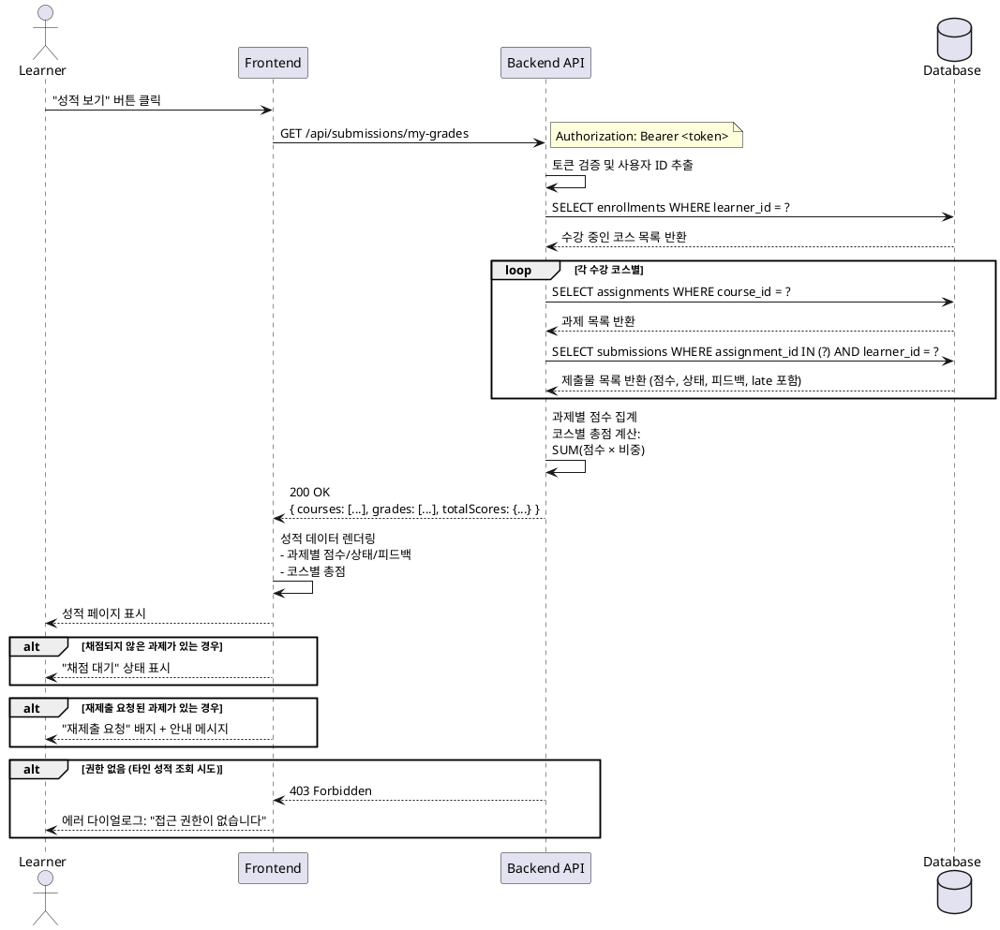

# 성적 & 피드백 열람 (Learner) - Use Case Specification

## Primary Actor

Learner (학습자)

## Precondition

- 학습자가 로그인된 상태
- 학습자가 최소 1개 이상의 코스에 수강신청(`enrollments`)이 완료된 상태
- 해당 코스에 과제(`assignments`)가 존재하고, 학습자가 최소 1개 이상의 과제를 제출(`submissions`)한 상태

## Trigger

학습자가 "내 성적" 또는 "성적 조회" 페이지에 접근

## Main Scenario

1. 학습자가 대시보드 또는 코스 상세 페이지에서 "성적 보기" 버튼 클릭
2. FE가 현재 로그인된 학습자의 인증 토큰과 함께 성적 조회 API 요청
3. BE가 요청자의 인증 정보를 검증하여 본인 여부 확인
4. BE가 학습자의 수강 중인 코스 목록 조회
5. BE가 각 코스별 제출된 과제 목록과 제출물 정보 조회
6. BE가 각 과제의 점수, 상태(submitted/late/graded/resubmission_required), 피드백, 지각 여부를 집계
7. BE가 코스별 총점 계산: `SUM(과제점수 × 과제비중)`
8. BE가 집계된 성적 데이터를 FE로 응답
9. FE가 성적 페이지에 과제별 상세 정보와 코스별 총점을 렌더링
10. 학습자가 과제별 점수, 상태, 피드백을 확인

## Edge Cases

### 1. 제출하지 않은 과제가 있는 경우
- 해당 과제는 "미제출" 상태로 표시
- 점수는 0점 또는 "N/A"로 표시

### 2. 채점되지 않은 제출물이 있는 경우
- 상태: "제출됨" 또는 "채점 대기중"으로 표시
- 점수: "채점 대기" 또는 "-"로 표시
- 해당 과제는 총점 계산에서 제외 또는 0점 처리

### 3. 재제출 요청 상태인 과제
- 상태: "재제출 요청됨" 표시
- 기존 점수와 피드백은 표시하되, 재제출 가능 안내 메시지 추가

### 4. 수강한 코스가 없는 경우
- 빈 상태(Empty State) 화면 표시: "아직 수강 중인 코스가 없습니다"

### 5. 과제가 없는 코스
- 코스는 표시하되, "과제 없음" 메시지 표시
- 총점: "N/A" 또는 "-"

### 6. 권한 없는 사용자(다른 학습자의 성적 조회 시도)
- 401/403 에러 반환
- FE에서 에러 다이얼로그 표시: "접근 권한이 없습니다"

## Business Rules

### BR-1: 본인 제출물만 조회 가능
- 학습자는 자신이 제출한 과제의 성적과 피드백만 조회 가능
- 다른 학습자의 성적은 조회 불가

### BR-2: 과제 점수 범위
- 점수는 0~100 범위 내에서만 표시
- 채점되지 않은 경우 점수 필드는 null 또는 "채점 대기" 상태

### BR-3: 지각 제출 표시
- 제출물의 `late` 플래그가 true인 경우 "지각 제출" 배지 표시
- 지각 제출도 점수에는 반영되지만, 시각적으로 구분

### BR-4: 코스 총점 계산
- 공식: `총점 = SUM(과제점수 × 과제비중)`
- 과제 비중(`weight`)은 0~1 범위 (예: 0.3 = 30%)
- 채점되지 않은 과제는 총점 계산에서 제외하거나 0점 처리
- 모든 과제의 비중 합이 1.0이 아닐 수도 있음 (Instructor가 자유롭게 설정)

### BR-5: 피드백 표시
- Instructor가 작성한 피드백은 학습자에게 전체 공개
- 피드백이 없는 경우 "피드백 없음" 표시

### BR-6: 상태별 표시 규칙
- `submitted`: 제출됨 (채점 대기)
- `graded`: 채점 완료 (점수 + 피드백 표시)
- `resubmission_required`: 재제출 요청됨 (기존 점수 + 재제출 안내)
- `late=true`: 지각 제출 배지 추가

### BR-7: 데이터 실시간성
- 성적 데이터는 실시간 조회 (캐싱하지 않음)
- Instructor가 채점을 완료하면 즉시 학습자에게 반영

---

## Sequence Diagram

